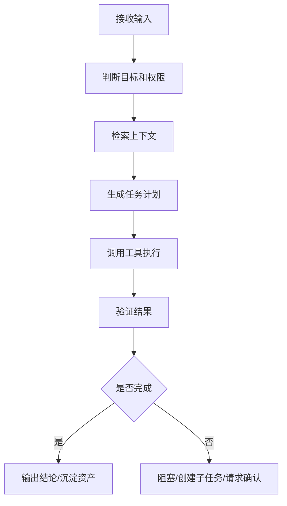

# GenGrowth Agent PRD 标准模板

> [!info] 一句话结论
> 这是一份给 GenGrowth 内部和客户项目使用的 Agent 产品需求文档模板。它的目标不是把 PRD 写漂亮，而是让一个 Agent 项目从“想法”变成“可实验、可验收、可复盘”的产品任务。

## 0. 使用场景

| 场景 | 适合使用吗 | 说明 |
|---|---:|---|
| 内部多 Bot / Agent Team 新能力 | 是 | 例如 PM Bot、Ops Bot、情报 Bot、日报 Bot |
| AI Builder 工具或 workflow 产品化 | 是 | 把 builder 经验转成可复用服务包或模板 |
| 客户 Agent 自动化项目 | 是 | 先定义任务、边界、验收，再进入实现 |
| 纯内容选题 | 不优先 | 除非要做成可复用工作流 |
| 单次脚本任务 | 不优先 | 用执行单即可，不必写完整 PRD |

## 1. PRD 首页

| 字段 | 填写说明 |
|---|---|
| 项目名称 | Agent / Workflow 的清晰名称 |
| Owner | 彪哥 / 玲姐 / Ops / Hermes / 客户方负责人 |
| 当前状态 | idea / draft / experiment / shipping / paused |
| 优先级 | P0 / P1 / P2 / 暂缓 |
| 目标用户 | 谁真的会用，不写“所有人” |
| 目标场景 | 用户在什么任务里会触发这个 Agent |
| 成功指标 | 用什么结果判断有价值 |
| 截止时间 | MVP 验收日期，不是最终上线日期 |

## 2. 用户与场景

### 2.1 用户是谁

| 用户类型 | 具体对象 | 是否真实可触达 | 当前替代方案 |
|---|---|---:|---|
| 主要用户 | 例：彪哥 / Ops / AI Builder 客户 | 是 / 否 | 现在怎么完成这件事 |
| 次要用户 | 例：玲姐 / 客户团队负责人 | 是 / 否 | 现在怎么检查结果 |

### 2.2 场景是什么

用一句话写清楚：

> 当【用户】在【场景】中遇到【痛点】时，需要 Agent 帮他完成【任务结果】。

示例：

> 当彪哥每天处理 AI Builder 情报时，需要 Agent 从分散链接中提炼产品机会、服务包和可执行实验，而不是只做新闻摘要。

## 3. 痛点与价值判断

| 问题 | 判断 |
|---|---|
| 这个痛点是否高频？ | 每天 / 每周 / 偶发 |
| 这个痛点是否高价值？ | 影响收入 / 交付效率 / 客户转化 / 团队协作 |
| 现有替代方案是什么？ | 人工处理 / 普通 ChatGPT / 脚本 / 外包 |
| 为什么现在要做？ | 当前任务地图中的位置 |
| 不做会怎样？ | 机会损失 / 交付低效 / 信息丢失 |

> [!warning] PM 判断
> 如果说不清真实用户、真实场景和当前替代方案，不要进入实现；先做访谈或内部 dogfood。

## 4. Agent 任务定义

### 4.1 输入

| 输入类型 | 示例 | 来源 | 是否稳定 |
|---|---|---|---|
| 链接 | 微信公众号 / X / GitHub / Blog | 用户发送 / RSS / 手动导入 | 中 |
| 文件 | PRD / transcript / 文档 | Wiki / Drive / 本地目录 | 高 |
| 指令 | “继续”“保存”“同步给 Ops” | Slack / 微信 / Kanban | 中 |
| 历史资产 | Wiki / GBrain / records | 本地知识库 | 高 |

### 4.2 输出

| 输出物 | 是否必须 | 验收标准 |
|---|---:|---|
| 结论 | 必须 | 3 行内讲清是否值得做 |
| 判断依据 | 必须 | 明确事实、假设、风险 |
| 任务拆解 | 必须 | 有负责人、优先级、验收标准 |
| Wiki / GBrain 沉淀 | 视情况 | 重要结论可复查、可检索 |
| Ops 执行单 | 视情况 | Ops 可直接照做，不含敏感上下文 |
| CEO 决策项 | 视情况 | 只给选项、风险和推荐，不替 CEO 定夺 |

### 4.3 不做什么

明确写出 Agent 的边界：

- 不代表 CEO 做公司级、财务、组织、人事、战略定夺；
- 不读取或转发其他 Bot 的私有 memory / session / prompt / token；
- 不把未核验信息写成确定事实；
- 不静默执行外发、删除、配置、花钱、客户承诺等高风险动作。

## 5. Agent Loop 设计

> Agent Loop（智能体循环）就是 Agent 每轮“看信息 → 做判断 → 用工具 → 验证结果 → 输出/沉淀”的过程。



| 环节 | 需要定义的问题 |
|---|---|
| 接收输入 | 从哪里来？Slack、微信、Kanban、RSS、文件夹？ |
| 判断目标和权限 | 是 PM 推进、CEO 决策，还是 Ops 执行？ |
| 检索上下文 | 查 Wiki、GBrain、代码、网页，还是历史 records？ |
| 调用工具 | 需要浏览器、终端、Slack、Kanban、GBrain？ |
| 验证结果 | 怎么证明真的完成？文件可读、链接可打开、测试通过？ |
| 沉淀资产 | 需要写 Wiki、GBrain、PRD、复盘、SOP 吗？ |

## 6. 工具与权限

| 工具/能力 | 是否需要 | 权限边界 |
|---|---:|---|
| 浏览器 | 视场景 | 读取公开网页、文章、截图，不绕过登录和付费限制 |
| 文件读写 | 视场景 | 写入前确认路径，不覆盖已有文件 |
| GBrain | 视场景 | 重要产物同步后必须 get/search 验证 |
| Slack/微信 | 视场景 | 外发团队频道前需确认，默认不把私密原文给 Ops |
| Kanban | 视场景 | 跨 Bot 协作用任务卡，不冒充其他 Bot |
| 定时任务 | 视场景 | 高影响自动化创建/暂停/修改前需确认 |

## 7. 记忆与上下文设计

| 类型 | 存哪里 | 规则 |
|---|---|---|
| 稳定偏好 | memory | 简短事实，避免临时任务进 memory |
| 方法流程 | skill | 复杂流程沉淀为可复用技能 |
| 正式结论 | Wiki / GBrain | 可检索、可复查、可链接 |
| 执行过程 | record / Kanban | 记录关键结果，不写密钥和隐私 |
| 临时状态 | 当前任务 / todo | 完成后不长期保存 |

## 8. MVP 定义

### 8.1 最小可验证版本

| 项目 | 要求 |
|---|---|
| 任务范围 | 只覆盖 1 个高频场景 |
| 输入数量 | 先用 5-10 个真实样本，不追求全量 |
| 输出形式 | 先生成 Markdown / Kanban 任务 / Slack 摘要 |
| 人工审核 | MVP 阶段默认保留人工确认 |
| 验收周期 | 1-2 周内能看到效果 |

### 8.2 MVP 不做

- 不做复杂后台；
- 不做全自动外发；
- 不一次性支持所有渠道；
- 不承诺 100% 正确；
- 不把 Demo 当稳定产品卖给客户。

## 9. 指标与验收标准

| 指标 | 解释 | 推荐阈值 |
|---|---|---|
| 任务完成率 | Agent 独立完成任务的比例 | MVP ≥ 70% |
| 人工接管率 | 需要人中途纠正/补信息的比例 | 越低越好，先记录基线 |
| 返工率 | 输出被退回重做的比例 | MVP < 30% |
| 可追溯率 | 输出是否有来源、路径、验证结果 | 关键任务 100% |
| 沉淀率 | 重要结果是否进入 Wiki/GBrain/PRD/SOP | 关键判断 100% |
| 复用率 | 同一流程是否被重复使用 | 2 周内至少复用 3 次 |

## 10. 风险清单

| 风险 | 表现 | 处理方式 |
|---|---|---|
| 用户不真实 | 只有想象中的用户 | 先 dogfood 或访谈 |
| 任务太大 | 一开始就做平台级系统 | 缩成单一场景 MVP |
| 权限越界 | PM Bot 替 CEO 做决策 | 输出决策建议，不直接定夺 |
| 工具不稳定 | 网页抓取、GBrain、平台 API 失败 | 保留本地文件和待复核状态 |
| 输出不可验收 | 只有总结，没有路径/负责人/标准 | 强制补验收标准 |
| 数据泄露 | 把私密上下文转给低权限角色 | 只传最小必要任务摘要 |

## 11. 角色分工

| 角色 | 负责什么 |
|---|---|
| 玲姐 | CEO-only 决策：商业策略、组织、人事、财务、重大优先级 |
| 彪哥 | PM 推进：定义需求、排序、验收、跨角色协作 |
| PM Assistant | PRD 草案、产品判断、实验拆解、沉淀 Wiki/GBrain |
| Ops | 资料整理、运营执行、低风险归档、已授权任务 |
| Hermes/default | 公共情报、系统自动化、BotOps、公共频道路由 |

## 12. PRD 可复制模板

```markdown
# [Agent 名称] PRD

## 1. 结论
- 是否值得做：
- 为什么现在做：
- 优先级：P0 / P1 / P2 / 暂缓

## 2. 用户
- 主要用户：
- 是否真实可触达：
- 当前替代方案：

## 3. 场景
- 触发场景：
- 输入来源：
- 期望输出：

## 4. 痛点
- 当前问题：
- 频率：
- 价值：
- 不做的损失：

## 5. Agent 方案
- Agent 要完成什么任务：
- Agent 不做什么：
- 需要哪些工具：
- 需要哪些上下文：

## 6. Agent Loop
1. 接收输入：
2. 判断目标与权限：
3. 检索上下文：
4. 执行工具：
5. 验证结果：
6. 输出/沉淀：

## 7. MVP
- 最小范围：
- 样本数量：
- 人工审核点：
- 截止时间：

## 8. 验收标准
- 任务完成率：
- 返工率：
- 可追溯率：
- 沉淀要求：

## 9. 风险
- 最大不确定性：
- 权限/安全风险：
- 失败止损方式：

## 10. 分工
- 玲姐：
- 彪哥：
- Ops：
- Hermes/default：

## 11. 下一步
- D1：
- D3：
- D7：
```

## 13. 推荐落地顺序

1. 先选一个内部真实场景：AI Builder 链接归档、PM 日报、Ops 素材整理或 Kanban 任务同步。
2. 用本模板写一页 PRD，不超过 30 分钟。
3. 用 5 个真实样本跑 MVP。
4. 记录任务完成率、返工率、沉淀率。
5. 复盘后再决定是否产品化或服务化。

## 相关阅读

- [[G-GenGrowth-Agent-Harness-Review-Checklist]] — 用于评审 Agent 是否具备可靠运行能力
- [[2026-05-19-子木聊AI出海-最近10篇好文归档]] — 子木内容中与 Agent PRD / AI Builder 增长相关的来源索引
- [[DeepSeek开招Harness产品经理-参与Agent桌面端产品全过程]] — DeepSeek Harness PM 能力画像与市场信号
