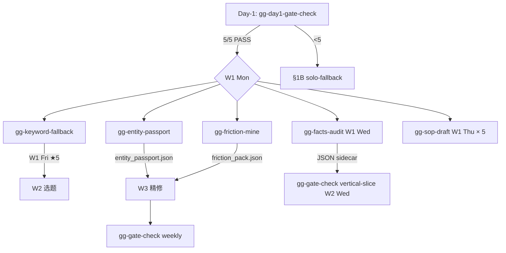

# GenGrowth 内部增长 MVP — Ops/PM 产品需求文档（PRD）v1.3

> [!danger] DEPRECATED 2026-05-21 — 整份文档 SUPERSEDED
> 本文档（PRD v1.x derivative line + 7 工具 PRD section）是基于 RACI v1 的企业级框架，**没读上游 Lynne PRD v0.7 就改了 schema**，方向跑偏。
> 真正 canonical 文档是 Lynne 已写好的 3 份：
> - `docs/03-marketing/03-seo/keyword-research-sop.md` v2.5（六源 + 四桶 + 三关过滤 + 占星品类切入规律）
> - `docs/03-marketing/03-seo/keyword-sheet-setup.gs` v3.1（24 列关键词主表 + 6-ID 体系 + 13 张表）
> - `docs/03-marketing/2026-05-15-gengrowth-internal-growth-mvp-prd-v0.7.md`（量产线/精修线 + 主题集群 + 心理安全规则）
>
> 本文档**仅作历史参考**，不要按此执行。新的端到端 SOP 看 `G-GenGrowth-精修文章-端到端-SOP-v1.md`（待按 Lynne 三档对齐重写）。

> 这份是给 **不写代码的人**看的产品需求文档：Ops、PM、合作伙伴、未来招的小伙伴、投资人或合规审查。
>
> 它回答：**做什么 / 为什么 / 给谁 / 什么时候 / 多少钱 / 怎么验收**。
>
> 技术接口、数据库字段、API 实现都在配套的"v1.2-lean2 技术版"，本文不展开。
>
> ⚡ **lean2 战略转向**：相对 lean1 的"5 周 60 篇 + 量产为主"，lean2 是"5 周 12-15 篇精修 + 质量为主"。砍掉 T3 量产工具线 + benchmark 对照实验；主力做精修线，每篇都奔 Top 10 + AI Overview / Perplexity 引用去。GEO（Generative Engine Optimization，2026 AI 搜索时代的 SEO）时代质量 >> 数量。

---

## §1 项目概览

### 1.1 一句话概括

**5 周内**把 astrologywiki.com 的 SEO 内容生产线（找词 → 写文 → 发布 → 复盘）从全手工变成**半自动**，建立**质量为主的精修内容线**，让单人产能从 5-7 篇手工/周 → 稳定 **2-3 篇精修/周**（v1.1.2 W1 砍载到 1 篇 standard-setting，W2 起 2-3 篇稳态）。每篇都奔着 **Top 10 排名 + AI Overview / Perplexity 被引用**去。**5 周累计 9-12 篇精修（v1.1.2 修正自 lean2 的 12-15）≥ 50 篇糊涂账**——这是 GEO 时代的核心要求。

### 1.2 关键词

- **半自动**：工具做重活（搜索、爬取、起草、汇总），人做关键判断（选题、修订、发布、止损）—— **永远不是全自动**
- **质量优先（lean2 核心，v1.1.2 砍载到 9-12 篇）**：每篇 ≥ 4h 端到端（Entity Passport + Friction 取证 + 跨模型挑战 + 心理安全全 SOP）；standard-setting 第 1 篇 8h。**不做 T3 长尾量产**——AI 答案不引用糊涂账
- **轻量**：**7 个交付物**（lean1 砍掉 MVP-1 T3 量产工具）。wzb + Ops 5h/周 5 周完成。不建平台，不建 dashboard
- **可降级**：任意工具失败都能回退到全手工，保证业务不中断
- **wzb 红线 18h/周**（Ops 接走 5-8h）：超线立即降级，工具开发让位于内容产出

### 1.3 这份 PRD 与上游 PRD 的关系

```
docs/03-marketing/2026-05-15-gengrowth-internal-growth-mvp-prd-v0.7.md   ← 业务总目标（北极星）
    ↓
本文（v1.2-lean Ops/PM PRD）   ← 把业务目标翻译成工具+流程，给 Ops/PM 看
    ↓
v1.2-lean 技术版               ← 把工具翻译成代码，给工程师看
```

---

## §2 业务背景与问题陈述

### 2.1 用户是谁

**主要用户（lean2）**：
- **wzb**：产品 owner / 唯一选题战略决策人 / 唯一 T1 精修审稿人 / 工程 manager / brand voice 拍板
- **Ops**：5-8h/周，接 M9 git mechanics + 周一数据复盘填决策列 + Reddit 运营 + 社媒草稿选发执行 + 关键词主表分桶 review

**未来用户**（不在 lean2 范围）：
- 未来 onboard 的产品 #2 团队

### 2.2 当前问题

| 问题 | 数据 | 后果 |
|------|------|------|
| 内容产能受单人瓶颈 | 当前 5-7 篇/周，wzb 全占 | 5 周内做不出 12-15 篇精修级别内容 |
| 已发 5 篇精选无数据基线 | 没有 Day 14/30/60 复盘 + 篇均 ranking 未知 | **lean2 决定：当作 0 基线，全部重做或重写升级** |
| 找词全手工 | 每周 2-3h 在 Ahrefs / 手工查 | 找的词偏向"有量但 SERP 红海"，不是"GEO 有机会" |
| GEO 取向工具栈空白 | Entity Passport / Friction 取证 / 跨模型挑战全手工 | 单篇精修 6-10h，无法 scale 到 3 篇/周 |
| 想做产品 #2 没有可复用工具 | astrologywiki 链路全靠 wzb 头脑 | 第二个产品要从零重做 |

### 2.3 60 天业务目标（lean2 GEO 取向重写）

| 目标 | 指标 | 检测时点 | judge（v1.1.2）|
|------|------|---------|-----------------|
| **Top 10 排名（核心 KPI）** | ≥ 3 篇精修进美国 GSC Top 10 | Day 60 | **Lynne**（sign-off）|
| **AI Overview / Perplexity 引用** | ≥ 3 篇被 AI 答案引用（GEO 时代真权威信号）| Day 60 | **Lynne**（sign-off）|
| Top 50 排名 | ≥ 10 篇进 Top 50 | Day 60 | Lynne |
| 累计精修发布 | ≥ 9-12 篇全精修（v1.1.2 砍 lean2 12-15；含 5 篇原精选的重写升级，当 0 基线重做） | Week-5 末 | wzb |
| 周产出 | 稳定 2-3 篇精修/周（v1.1.2 W1 砍载到 1 篇，W2 起 2-3 稳态）| 连续 2 周满足 | wzb |
| Day 14 收录率 | ≥ 80%（精修应该都被收录） | 每篇 Day 14 | wzb |
| T1 单篇审稿时间 | ≤ 90 min（精修线核心） | 每周自报 | wzb |
| T2 单篇审稿时间 | ≤ 45 min | 每周自报 | wzb |
| wzb 周工时 | ≤ 18h（Ops 接走 5-8h；v1.1.2 W1 实际 ~16h） | 每周自报 | wzb |
| 月度外部 API 成本 | ≤ $100（无量产线 → 成本下降）| 月底对账 | wzb |

**为什么改 GEO 取向**：上游 PRD §1.1 写 PV 目标，但 lean1 解读偏向"量产铺词增 PV"。autoplan 3-voice 评审一致指出：(a) AI 搜索时代量产长尾在 AI 答案中几乎不被引用；(b) PV 是 lag indicator，Top 10 排名 + AI Overview 引用是 lead indicator；(c) 已发 5 篇精选数据未复盘，没有证据证明 14 篇/周量产能拉动 PV。**lean2 决定：先证明能做出排进 Top 10 + 被 AI 引用的精修内容，再谈 scale**。

---

## §3 方案范围

### 3.1 v1.2-lean2 建什么（3 工具 + 3 脚本 + 1 SOP = 7 个交付物，砍 lean1 的 MVP-1）

| # | 交付物 | 解决的业务问题 | 上线周次 |
|---|--------|---------------|---------|
| 1 | 🔍 **找词工具** `/gg-keyword-mine` | 找 **10-15 个真机会词**（GEO 取向：弱 SERP + 真问题 + 可建权威），不是 800+ 候选词撒网 | Week-2 |
| 2 | ✍️ **写文精修工具** `/gg-content-draft` | T1/T2 精修单工具（lean2 合并 MVP-1+MVP-2）：Entity Passport + Friction 取证 + 跨模型挑战 + 心理安全全 SOP + Phase 2 hold 默认开 | Week-3 |
| ~~3~~ | ~~写文工具基础版 MVP-1（T3 量产）~~ | ~~lean2 砍掉。质量优先 pivot 不需要量产~~ | ~~—~~ |
| 4 | 🔗 **CTA 注入工具** `/gg-cta-inject` | 把 Google Sheets CTA 配置注入文章 frontmatter | Week-4 |
| 5 | 📣 **社媒草稿工具** `/gg-distribute-draft` | 精修线偏重 **Newsletter 长文 + Reddit 深度讨论**（4-6 候选），不是 X 100 tweet 撒网 | Week-4 |
| 6 | 📊 **数据回填脚本** `bin/event-export` | Ops 周一手动跑（wzb 当周看决策列），自动拉 GSC + GA4 + AI Overview 引用监测 | Week-4 |
| 7 | ✅ **技术 SEO 闸门扫描** `bin/seo-gate-scan` | 批量扫 9-12 篇文章的 canonical / robots / CWV / schema.org | **Week-5**（v1.1.2 推迟，原 Week-4 5 件 ship 砍 3）|
| 8 | 📝 **发布回填脚本** `bin/publish-backfill` | 半自动注入 frontmatter + 回填 Sheets URL / Status | Week-4 |

**M9 手动 SOP**：发布回填的 9 步操作（Ops 主跑，wzb 在 T1/T2 关键节点接管，配合 `bin/publish-backfill`）

### 3.2 v1.2-lean2 不建（保持手工，PM 不用纠结）

| 项目 | 不建的理由 |
|------|-----------|
| **PGB 写作** | 个人创造性工作，工具化无价值。产品 #2 onboard 时再上 `/gg-pgb-draft` |
| **T3 量产工具线（lean2 砍）** | 质量优先 pivot 决定不做量产。AI 搜索时代糊涂账长尾不被引用，浪费 wzb 时间 |
| **benchmark gate 5+5 对照实验（lean2 砍）** | lean2 没有量产线 → 没有量产对照概念。精修线用 Top 10 + AI Overview 引用 binary 信号验证 |
| **集群构建自动化** | 800 词聚类自动化对单产品 MVP 没必要；wzb 花 2h 一次性人工命 20-30 cluster，质量不输算法 |
| **周报自动化** | wzb 每周一手写 1h，模板 + Sheets 筛选视图够用 |
| **刷新决策自动化** | Day 14/30/60 节点的 sunset/刷新/合并决策都是判断活，wzb 每月人工扫一次 30 min 即可 |
| **数据回填全自动** | 每周一 Ops 手动跑脚本（10-15 min），wzb 在周报会议看 raw 数据填决策列 = 半自动 |
| **社媒最终发布** | 草稿半自动生成，**选发哪条 + 时机 + 互动**全手工（Ops 做选发执行，wzb 拍板 brand voice） |
| **退场决策** | 工具列清单，wzb 拍板 |

### 3.3 v1.3 才考虑（边界外）

- 第二个产品 onboard（≥ 30 天后）
- 深度报告生成（订阅产品核心交付，目前未启动）
- Newsletter double opt-in（合规升级）
- 自动 A/B 测试
- 跨产品 dashboard
- `/gg-event-sync` 自动化（触发条件：已发布 ≥30 篇精修 + 手工流程连续 3 周稳定）
- T3 量产工具线（如果未来 Top 10 拿了 5+ 篇 → 用量产 reinforce cluster authority）

---

## §4 用户故事（User Stories）

### 4.1 主用户故事（wzb + Ops 双视角）

**Story 1：每周一数据复盘（Ops 主跑 + wzb 决策列拍板）**
> 作为 Ops，
> 我希望周一早上跑 `bin/event-export --week 2026-Wxx`，10 min 内拉到上周所有已发布精修文章的 GSC + GA4 + **AI Overview / Perplexity 引用检测**数据，写到结果复盘表的 raw 数据列。
>
> 作为 wzb，
> 我希望周报会议（每周二早上 30 min）看 Ops 填好的 raw 数据，**亲自填决策列**（sunset / 刷新 / 升级到 Tier 1 重写 / 继续观察）。这是质量优先 pivot 的核心动作：每篇文章是不是真的在 GEO 时代起作用，我每周都看。

**Story 2：T1/T2 精修写文（wzb 全程接管）**
> 作为 wzb，
> 我希望从选题登记表挑一个 page_id（Tier T1 或 T2），跑 `/gg-content-draft --tier T1 --pause-after-phase2`，约 15 min 后拿到 Phase 2 草稿 hold 点。
> 我看草稿决定是否继续 Phase 3，过红线 + 跨模型挑战 + 心理安全全 SOP 后跟 M9 SOP 推到 oracle PR。
>
> 单篇精修端到端：找词 + Entity Passport 取证 + Friction 取证 + AI 组装 + 双向语义布线 + 6 红线 + 审稿 = **4-5h**（lean2 接受这个时间，因为精修的杠杆 = Top 10 + AI 引用）。

**Story 3：每月一次扩词找机会（wzb 战略 + Ops 分桶 review）**
> 作为 wzb，
> 我希望每月初挑 50-100 个种子词，跑 `/gg-keyword-mine --geo-mode`，30 min 后关键词主表新增候选词 + GEO 机会评分（弱 SERP + 真问题 + 可建权威三维度）。
> **目标不是 800 候选，是 10-15 个真机会词**，lean2 砍掉量产逻辑。
>
> 作为 Ops，
> 我在 Sheets 前端做初步分桶 review（P 列），把明显能产出精修内容的标 ★ 给 wzb 拍板。

**Story 4：精修线社媒发布（wzb 选 + Ops 执行）**
> 作为 wzb，
> 我希望精修文章发布后跑 `/gg-distribute-draft --page-id X --depth deep`，3 min 内拿到 4 个 Newsletter 长文候选 + 6 个 Reddit 深度讨论候选 + 4 个 X 长 thread 候选（不是 100 tweet 撒网）。
> 我选 1-2 个 brand voice 拍板。
>
> 作为 Ops，
> 我按 wzb 选定的候选**执行发布**（时机 + 互动 + 二次评论），每周省 wzb 4-6h 社媒时间。

**Story 5：M9 发布回填（Ops 主跑）**
> 作为 Ops，
> 我跟着 M9 SOP（9 步操作），把 wzb 审过的 `_staging/{page_id}/draft.md` 推到 oracle PR，merge 后跑 `bin/publish-backfill --confirm` 回填 Sheets（W 列 URL + V 列 Status='已发布' + Last Audit）。
> wzb 在 M9 中只在"oracle PR review + merge"一步介入（5 min/篇）。

### 4.2 未来用户故事（产品 #2、未来扩 Ops）

**Story F-1：产品 #2 onboard（v1.3）**
> 作为新产品 owner，
> 我希望复制 `config/astrologywiki.json` 改成 `config/<new-product>.json`，写一份新的 templates_dir，工具栈即可服务新产品。
> 不需要改 gg-lib 代码。

**Story F-2：Ops 扩 2 人（v1.4，当精修产量 ≥5 篇/周时触发）**
> 作为第二个 Ops，
> 我接更深的 Reddit 运营 + Newsletter 数据分析 + 排名监测，让 wzb 完全脱离日常运营。

---

## §5 关键决策原则

下面是 v1.2-lean2 在设计取舍时遵循的原则（PM 应清楚这些原则，未来争论时回到这里）。

### 5.1 质量 >> 数量（lean2 第一原则）

- AI 搜索时代（2026）的事实：长尾 T3 内容在 AI Overview / Perplexity / ChatGPT 答案中**几乎不被引用**
- 9-12 篇真权威精修 > 60 篇糊涂账（v1.1.2 砍 lean2 12-15）
- 已发 5 篇精选当 0 基线重做或重写升级——不为节省 5 篇的工作量妥协质量
- benchmark gate（量产对照实验）lean2 砍掉，**Top 10 + AI Overview 引用是 binary 信号**，比"对照下降 30%"更硬

### 5.2 半自动 ≠ 工具能做就工具做

- 半自动 = 工具做**重活**（重复、可枚举、低判断），人做**判断**（选择、修订、止损、命名）
- 反例：`/gg-event-sync` 全自动从拉数到决策建议到发 Telegram，**剥夺了 wzb 每周一亲自看数字的机会**——已改半自动 `bin/event-export`
- 正例：`/gg-distribute-draft` 生成多平台候选草稿，wzb **brand voice 拍板**，Ops **执行发布**

### 5.3 轻量 ≠ 简单，是"不超前抽象"

- 不为"产品 #2 也许会用"而抽象 ProductProfile / ContentRepoAdapter
- 不为"工具数 5+ 也许会 IO drift" 而上 verify-skill-contracts CI
- 等真实需求出现再加。**v1.3 trigger** 定义在技术版 §11

### 5.4 wzb 18h/周 + Ops 5-8h/周，超线立刻降级

- v1.2 原本 32h，5 reviewer 警告"manage Claude Code"开销被低估
- lean1 收紧到 24h，autoplan 评审一致指出 24h 仍无 buffer 不可持续
- **lean2 决策**：wzb 红线 18h（精修主线），Ops 5-8h（接 M9 + 数据复盘 + Reddit + 社媒选发 + 关键词分桶 review）
- 超线 → 停工具开发，只产内容（PRD §1 优先级：精修内容 > 工具）

### 5.5 wzb 永远是 T1/T2 最后审稿人

- 所有写文工具默认 dry-run
- 草稿先到 `_staging/` 暂存，**不直推 oracle**
- 即使 6 红线全过，wzb 仍审 markdown 才发
- T1/T2 精修线 hold 点 `--pause-after-phase2` **默认开**（lean2 不再分量产/精修双默认）
- "默认通过率" < 30%（行为验收指标）

### 5.6 业务指标 > 工具指标（GEO 取向）

- v1.2 原 §11 列了 8 条"自我安慰指标"（如 "Sanitizer fixture 过"）
- lean 版 §6 重写为业务 / 行为 / 工具**三类**，业务在前
- lean2 业务 KPI 全改 GEO 取向：Top 10 + AI Overview 引用 > impressions > 收录率 > 发布数

---

## §6 验收标准（三层 KPI）

### 6.1 业务 KPI（GEO 取向，核心，决定项目成败）

| 指标 | 目标值 | 检测时点 | 谁负责 |
|------|--------|---------|--------|
| **Top 10 排名（核心 KPI）** | ≥ 3 篇精修进美国 GSC Top 10 | Day 60 | **Lynne**（v1.1.2 sign-off；wzb 不投票）|
| **AI Overview / Perplexity 引用** | ≥ 3 篇被 AI 答案引用（每周 Ops 巡 + 抽查） | Day 60 | **Lynne**（决策）/ Ops（监测）/ wzb（数据准备）|
| Top 50 排名 | ≥ 10 篇进 Top 50（含 Top 10）| Day 60 | **Lynne**（v1.1.2）|
| 累计精修发布 | ≥ 12 篇（保守）~ 15 篇（理想），全精修 | Week-5 末 | wzb + Ops |
| 周产出 | ≥ 3 篇精修/周连续 2 周 | Week-4 + Week-5 | wzb |
| Day 14 收录率 | ≥ 80%（精修文章应该都收录） | 每篇 Day 14 | Ops 监测 |
| 月度成本 | ≤ $100（无量产线，成本下降） | 月底对账 | 自动（cost ledger） |

**为什么这套 KPI**：
- **Top 10 是 lead indicator**：排进 Top 10 = Google 算法认可质量；没进 = 任何 PV 增长都是噪声
- **AI Overview / Perplexity 引用是真权威信号**：AI 答案引用 binary 信号，且 GEO 时代是流量主入口
- 收录率 ≥ 80% 在精修线是合理要求（量产 70% 是低于精修标准）
- "Top 50 词数" 改 "Top 50 排名 ≥ 10 篇"——精修线关注文章排名不是词数

### 6.2 行为 KPI（半自动定位是否守住）

| 指标 | 目标值 | 采集方式（lean1 被动采集 + lean2 加 Ops 配合）|
|------|--------|---------------------------------------------|
| T1 实际审稿时间 | < 90 min/篇 | `manifest.review_duration_min`（wzb merge 时输入） |
| T2 实际审稿时间 | < 45 min/篇 | 同上 |
| ~~T3 实际审稿时间~~ | ~~lean2 砍 T3 量产~~ | — |
| 默认通过率（未做实质修改就发）| < 20%（lean2 收紧，精修线本应改更多） | `manifest.accepted_without_edits=true` 占比，月底由 `bin/event-export --report behavior` 自动汇总 |
| 随机抽查失败率（wzb 每周抽 1 篇深读 + Ops 抽 1 篇）| < 10% | 周报模板强制填空（不填 wzb 自己看不到周报）|
| M9 漏填率（W 列 URL 24h 内未填） | < 5% | `bin/publish-backfill --audit` 自动扫选题登记表 W 列 |
| **AI 引用监测周覆盖率** | 100%（Ops 每周二跑覆盖 ≥ 95% 精修文章）| Ops 手动 + 半自动脚本辅助 |
| 周一 `bin/event-export` 执行率 | 5/5 | runs 表 actor=ops 行的 started_at 字段，自动统计 |
| **Ops 协调健康度** | wzb 与 Ops 每周对齐 ≥ 1 次（周报会议）| 周报会议 attendance 自报 |

**为什么这层重要**：codex 警告"半自动会自然漂移——工具跑顺后变成'看头部 3 篇 + 抽查 2 篇 + 其他 9 篇默认过'"。行为 KPI 是检测漂移的防线。

**lean1 被动采集升级 + lean2 Ops 加入**：lean1 把 4 项核心指标改为**被动采集**：
- `/gg-content-draft` 在 wzb merge 后必须输入 `review_duration_min` + `accepted_without_edits` 才能进入 publish-backfill，工具拦截
- 月度由 `bin/event-export` 自动从 runs 表算出"默认通过率"
- 周报模板的 4 项指标空格强制填写（wzb 自检的 forcing function）

这样不增加工时但减少自欺空间。详见技术版 §4.2 manifest schema + §10.2 采集细节。

### 6.3 工具 KPI（必要的工程质量）

| 指标 | 目标值 |
|------|--------|
| 找词工具不破坏 Google Sheets 公式列 | 100%（单测覆盖 3 种 range 格式） |
| 写文工具 6 红线通过率 | ≥ 95% |
| Adversarial 注入 fixture 必拒（防 prompt injection） | 100% |
| Sanitizer 中/韩/阿姓名 fixture 单测过 | 100% |
| `bin/event-export` 200 页 < 60s | 100% |
| 并发锁拒绝单测过 | 100% |
| `--dry-run` 不写 prod | 100% |
| 3 SA 实施 + 轮换 SOP 文档化 | 100% |
| `/gg-distribute-draft` 14 篇 < 10 min + UTM 正确 | 100% |
| `bin/seo-gate-scan` 14 篇 < 5 min + actionable items | 100% |

---

## §7 5 周里程碑路线图（lean2 重画 — 质量 pivot）

```
Week-0      Week-1       Week-2         Week-3         Week-4              Week-5
   │           │            │               │              │                   │
[启动 +     [手工产      [找词工具        [写文精修       [配套 4 工具        [全工具稳态
 facts-     2-3 篇      + gg-lib]        工具 ship]      ship +              + 数据回收]
 audit +    精修基线    + Ops onboard                    Ops 接 M9 + 数据]
 GCP +      (4-5h/篇)   完成
 Ops align]
            
DataForSEO  2-3 篇精修   /gg-keyword-     /gg-content-    /gg-cta-inject       2-3 篇精修
正式可用     基线          mine + 2 篇    draft 精修      + /gg-distribute     + 全数据回收
+ facts                  精修            + 3 篇精修       + bin/event-       + AI 引用监测
audit done                                                 export +
+ Ops                                                      bin/seo-gate +
onboard                                                    bin/publish-
SOP                                                        backfill +
                                                           3 篇精修
   │           │            │                │              │                   │
   4.5h        ~16h          17.5h            18h             17h                16h
   (Day-0 4 件:                              (顶红线)         (lean2.1 砍 3 件      (v1.1.2 加
   Ops+GCP+5 篇                              W4 5→3 件 +       ship, Mon-Tue       2 件推迟
   +Lynne sign-off                           manifest schema    publish-backfill / ship + 月度
   v1.1.2)         (v1.1.2                  lock + sanitizer    Wed-Thu cta-inject  KPI)
                   砍载到 1 篇 +              fixture 前移)      / Fri event-export
                   2 SOP，第 2 篇                                 MVP)
                   推 W2)

5 周累计：9-12 篇精修（v1.1.2 砍 lean2 12-15；下限 9=1+2+3+2+1，上限 12=1+2+3+3+3）
wzb 总工时: 4.5+16+17.5+18+17+16 ≈ ~89h（v1.1.2 W1 砍载 -2h，W4 砍 5→3 件 -3h，W5 +2h 吸收推迟 ship，Week-0 +0.5h Lynne sign-off）
Ops 工时:   0+2+4+5+6+5 = 22h (Week-1 onboard training 2h, Week-2 起逐步接更多)
```

> **v1.2-lean2 修订**：
> - 周产从 12-13 篇（lean1）调整为 **2-3 篇精修**（5 周累计 12-15 篇）
> - Week-0 加 **facts-audit 脚本**（autoplan Finding 4，2h）+ **Ops onboard SOP 写**（2h）
> - Week-1 末加 **4h Claude Code 工程 spike**（autoplan Finding 6，验工程产能）
> - 砍 benchmark gate（autoplan Finding 5 + 质量优先 pivot）
> - Week-4 仍是 4 工具 ship 高位（20h），但 Ops 接走 6h 让 wzb 实际 14h，可控

### 关键里程碑

| 时点 | 里程碑 | 谁拍板 | 状态 |
|------|--------|--------|------|
| **Day 0** | DataForSEO 已正式（无需 KYC 等待）+ GCP billing 绑卡（Sheets/GSC/GA4 API + 3 SA 管理，非 LLM）+ Ops align（介绍范围 + onboard 时间表）| wzb（立即开工） | — |
| **Week-1 末** | (1) facts-audit.md 全绿（autoplan Finding 4：每条 oracle/sheet/code 断言贴 SHA + line）(2) Ops onboard SOP 完成 (3) 2-3 篇精修基线发布 + 实测工时校准 (4) **4h Claude 工程 spike 通过**（CLI + config + Sheets dry-run + runs 写入 + formula guard + vitest，validate 工程产能假设） | wzb | — |
| **Week-2 末** | `/gg-keyword-mine` ship + DataForSEO fixture 落档 + Day 3-4 manage 自检 + 2 篇精修发布 | wzb | — |
| **Week-3 末** | `/gg-content-draft` 精修工具 ship + 3 篇精修发布（首批用工具的精修）| wzb | — |
| **Week-4 末** | 4 配套工具/脚本 ship（CTA inject / 社媒草稿 / 数据回填 / 技术 SEO 闸门 + 发布回填）+ 3 篇精修发布 + Ops 接 M9 + 数据复盘 | wzb | — |
| **Week-5 末** | 全工具稳态 + 2-3 篇精修发布 + 三层 GEO 取向 KPI 验收 + Day 14 节点数据回收 | wzb | — |

### 失败保护

- 任一周 wzb > 18h → 自动降级（停工具开发，只产精修内容）
- **Week-1 末 Claude 工程 spike 失败**（manage > 4h 还没跑过最薄闭环）→ 重估 Week-2 工程范围，砍到 2 lib + 0 工具
- **Week-2 Day 3-4 自检**：manage Claude Code 累计 ≥3h 且 gg-lib 完成 ≤2 模块 → 缩范围，Week-2 只 ship 2 lib + 0 工具，`/gg-keyword-mine` 推 Week-3
- Week-4 任一新工具翻车 → 推到 Week-5，其他照常 ship
- **Ops 退出风险**（v1.1.2 修正）：Ops 中途不能继续 → **不再放宽 wzb 红线**（lean2 已证伪 24h），切 plan §1B solo-fallback plan（6 周 / 6-8 篇 / wzb 20h），工具线砍到 2 skill + 1 bin（content-draft / cta-inject / publish-backfill），event-export + seo-gate-scan + distribute-draft 全砍。lean2.1 §7.4 已落档。

---

## §8 角色与职责（lean2 加 Ops）

### 8.1 当前团队 = wzb + Claude Code + Ops

| 角色 | 工时占比 | 谁来扛 |
|------|----------|--------|
| 产品决策（PM）| ~15% | **wzb 独占** |
| T1/T2 精修内容审稿（reviewer）| ~35% | **wzb 独占** |
| 选题战略 + brand voice 拍板 | ~10% | **wzb 独占** |
| 工程实施（eng）| ~25% | **Claude Code 出实现 + wzb 审 review**（不含 Ops）|
| 运营落地（ops）| ~15% | **Ops 接** 5-8h/周（M9 git + 数据复盘填决策列 + Reddit + 社媒选发执行 + 关键词分桶 review）|

**关键假设（lean2 锁定）**：
- wzb 是 PM + 工程 manager + T1/T2 审稿人 + 战略决策者，**不是 keyboard engineer**
- Claude Code 出 80% 实现代码（Week-1 末 4h spike 验证此假设是否成立）
- **Ops 不替代工程 manage**，Ops 接的是运营落地（M9/Reddit/社媒/数据复盘）

### 8.2 工具业务 owner（决策权）

| 工具 / 脚本 | 业务 owner | 工程实施 | 日常运营 |
|------------|-----------|---------|---------|
| `/gg-keyword-mine` | wzb（GEO 取向选词决策）| Claude Code | Ops 做 P 列分桶 review |
| `/gg-content-draft` | wzb（T1/T2 审稿 + brand voice）| Claude Code | — |
| `/gg-cta-inject` | wzb（CTA Map E 列拍板）| Claude Code | Ops 维护 CTA Map sheet |
| `/gg-distribute-draft` | wzb（候选选 + brand voice）| Claude Code | **Ops 执行发布**（时机 + 互动）|
| `bin/event-export` | wzb（看决策列）| Claude Code | **Ops 周一跑 + 数据填入** |
| `bin/seo-gate-scan` | wzb | Claude Code | Ops 看报告做初判，wzb 拍板 |
| `bin/publish-backfill` | wzb（merge 审）| Claude Code | **Ops 跑 M9 SOP** |
| M9 SOP | wzb | — | **Ops 主跑**，wzb 在 oracle PR review 介入 |

未来扩 Ops 2 人时（v1.4 trigger：精修产量 ≥5 篇/周），按"Newsletter 数据分析 + 排名监测 + 深度 Reddit 运营"顺序分担。

---

## §9 工时表（v1.1.2 sync：W1 砍载 + W4 砍 5→3 件 + W5 吸收推迟 ship）

| 周 | wzb 内容产出 | wzb 运营 | wzb 工程管理 | wzb 决策/PGB | **wzb 合计** | Ops 工时 | 状态 |
|----|------------|---------|-------------|------------|-------------|---------|------|
| **Week-1** | 8h（1 篇 standard-setting 含 shadow 教学增量分摊；**v1.1.2 砍第 2 篇推 W2**） | 1h | 0h | 7.5h（facts-audit 2h + 2 SOP 1h + Claude spike 4h + retro 0.5h） | **~16h** ✅ | 2h（onboard 培训）| 留 2h buffer |
| **Week-2** | 9h（2 精修：W1 推迟件 + W2 新发 1）| 2h（Ops 协调）| 4h（manage gg-lib 4 + `/gg-keyword-mine` + manifest schema lock + sanitizer fixture）| 2.5h（含 Reddit SOP + ai-monitor SOP 各 30 min）| **17.5h** | 4h（M9 接手 + 分桶 review）| ✅ |
| **Week-3** | 9h（3 精修，首批用 `/gg-content-draft`）| 2h | 5h（manage `/gg-content-draft` ship）| 2h | **18h** | 5h（M9 + Reddit + 周一数据复盘 + AI 引用监测）| ⚠️ 顶红线 |
| **Week-4** | 7h（2-3 精修）| 2h（Ops 已接大头）| **6h**（manage 3 件 ship：publish-backfill / cta-inject / event-export MVP；v1.1.2 砍 5→3）| 2h | **17h** ✅ | 6h（全接 M9 + 数据复盘 + 社媒选发执行）| 不再顶红线 |
| **Week-5** | 5h（1-2 精修稳态）| 2h | **7h**（manage 2 件推迟 ship：distribute-draft + seo-gate-scan + bug fix + 月度 KPI 汇总）| 2h | **16h** ✅ | 5h（稳态 + AI 引用监测）| ✅ |

**wzb 合计 5 周**：~16+17.5+18+17+16 = **~84.5h**
**Ops 合计 5 周**：2+4+5+6+5 = **22h**
**总人力**：~106.5h
**5 周累计精修发布**：1+2+3+(2-3)+(1-2) = **9-12 篇**（v1.1.2 砍 lean2 12-15；下限 9，上限 12）
**Week-6 retro**：wzb 12h / Ops 5h / Day 30 retro gate（Lynne judge）

> [!info] v1.1.2 critical 关键变化（vs lean2）
> 1. W1 总数 18→~16h（砍 standard-setting "暗中加 3h" 教学增量 + 第 2 篇推 W2 + Reddit SOP 推 W2）
> 2. W4 总数 20→17h（砍 5 件 ship → 3 件，distribute-draft + seo-gate-scan 推 W5）
> 3. W5 总数 14→16h（吸收 2 件推迟 ship + 月度 KPI）
> 4. 5 周累计精修 12-15 → 9-12（lean2 → v1.1.2）
> 5. 加 Week-0 4 件事 4.5h（含 Lynne sign-off commit conversation）
> 6. Day-1 Ops binary gate 4 → 5/5 pass（含 Lynne sign-off）
> 7. Day 30/60 kill judge wzb → Lynne

**红线机制**：
- wzb 任一周实际投入 > 18h → 自动降级（停工具开发只产内容）
- **Week-3 / Week-4 顶高位预警**：剩余 buffer < 2h 时立刻砍工具范围
- **Ops 接走的工时是 firm commitment**：如果 Ops 当周不可用，wzb 应急 +5h，可能破 18h，触发 Week-5 缓冲

**Week-1 为何顶红线 18h**（lean2 校准）：质量优先 pivot 后单篇精修端到端 4-5h，2-3 篇 = 8-15h；加 facts-audit 2h + Ops onboard SOP 2h + 决策 1h = 13-20h。中位 18h 顶红线但不会破。

**Week-2 Claude spike**（autoplan Finding 6 + lean1 Day 3-4 自检）：Week-1 末投 4h 验证最薄闭环（CLI + config + Sheets dry-run + runs + formula guard + vitest）。spike 顺利 → 保留 4h/周 manage 假设；spike 不顺利（>4h 没跑过）→ Week-2 范围立刻砍。

**Week-4 顶高位 20h 是真风险**（lean2 watch）：4 工具 + 3 精修同周。Ops 在 Week-4 接 6h（M9 + 数据复盘 + 社媒）让 wzb 净时间 14h。**前提**：Ops 在 Week-3 已经训练好；如果 Week-3 Ops onboard 不顺利 → Week-4 wzb 会破 24h 红线 → 必须 Week-3 末砍 Week-4 范围。

**关键变化 vs lean1**：lean1 红线 24h，Week-4 22h，Week-1 24h 顶线。**lean2 收紧 wzb 红线到 18h**（Ops 接走 5-8h 抵掉缺口），同时质量 pivot 让 5 周累计从 60 篇调整为 12-15 篇。

---

## §10 成本与 ROI

### 10.1 月度外部 API 预算

| 服务 | 用途 | 月度预算 |
|------|------|---------|
| DataForSEO | 关键词扩展（Labs） + SERP 检查 + Top10 DR | $50 软限 / $150 硬顶 |
| **Anthropic Claude API**（LLM）| `/gg-content-draft` sonnet 草稿生成 | $20-40 |
| **OpenAI Codex API**（LLM，手动 T1 跨模型挑战） | 仅 T1 偶发用 | $0-5 |
| **Google Cloud Platform**（**非 LLM**，3 项 Google 数据服务 + IAM）| ① Sheets API 读写 5 张主表 ② GSC `searchAnalytics.query` 拉 page-level 数据 ③ GA4 Data API 拉行为数据 ④ 3 个 Service Account 管理（reader/writer/admin） | $0-5（免费配额内，billing 绑卡只为 enable API） |
| Vercel / GitHub | 部署 / cron | $0（已付费） |
| **合计** | — | **~$70-100/月**（**硬顶 $150**） |

**澄清（FAQ 高频问）**：GCP **不是**为了 LLM——LLM 走 Anthropic / OpenAI 各自直连 API。GCP 只承担 Google 系数据读写（Sheets + GSC + GA4）+ Service Account IAM。月度 $0-5 是真实开销，绑卡是 enable API 的前置不是收费门槛。

### 10.2 单篇文章成本

| Tier | 描述 | 单篇 |
|------|------|------|
| T1 | 精修线（跨模型挑战、深度取证） | < $10 |
| T2 | 中等长度（单模型 + 取证） | < $1 |
| T3 | 量产长尾 | < $0.3 |
| 社媒草稿 | 4 平台 × 3 候选 | ~$0.24 |

### 10.3 ROI 视角

**Week-1 基线**（手工）：14 篇 × 45 min/篇 = 10.5h 纯审稿/周 + 找词 2-3h + 社媒草稿 4-6h + 数据复盘 2h = **每周 ~20h 在重复操作上**

**Week-5 目标**（工具化）：14 篇 × 30 min/篇 = 7h 纯审稿/周 + 找词 < 30 min（月度跑一次摊薄）+ 社媒草稿 0.5h（选发）+ 数据复盘 0.5h（周一脚本） = **每周 ~8h 在重复操作上**

**周节省**：~12h × 52 周 = **624h/年** ≈ **78 个工作日 / 年**

折成"等价人手"：约 0.3 个全职助理的工作量。$70-100/月 vs 雇助理（≥$2000/月）。**ROI 显著**。

但注意：**这是工具 ship 之后的稳态收益**。开发 5 周内 wzb 净投入而非节省。

---

## §11 风险与降级机制

### 11.1 主要风险与应对

| 风险 | 影响 | 应对 |
|------|------|------|
| ~~DataForSEO 账号 KYC 慢~~ | ✅ **已正式**（lean2）| Day-0 直接开工 |
| **Week-1 facts-audit 发现 lean1 假设有错**（lean2 新增）| 工具栈基础事实需重验 | 立刻修正 §2.1 表 + 重估 §3 工具范围；最坏推迟 Week-2 工程开工 |
| **Week-1 末 Claude 工程 spike 失败**（autoplan Finding 6）| Claude Code 80% 假设不成立 → wzb manage 时间膨胀 | 重估 Week-2 工程范围：砍到 2 lib + 0 工具，`/gg-keyword-mine` 推 Week-3 |
| **Week-2 manage Claude Code 超 4h 预算**（lean1）| gg-lib 4 模块 + 1 工具来不及 | **Day 3-4 强制自检**：累计 manage ≥3h 且完成 ≤2 lib 模块 → Week-2 缩范围 |
| Claude Code 出码质量不及预期 | wzb manage 时间膨胀，超 18h 红线 | 18h 红线触发自动降级；最坏情况推迟工具 1 周 |
| 任意周 wzb > 18h | 累积疲劳 | 自动降级，只产内容 |
| **Ops 中途退出**（lean2 新增；lean2.1+patch 修正）| wzb 接所有运营 → +5-8h/周 | ~~wzb 红线放宽到 24h~~ SUPERSEDED → **立刻切 plan v1.1.3 §1B solo-fallback plan**（6 周 / 6-8 篇 / wzb 20h），工具线砍到 2 skill + 1 bin（content-draft + cta-inject + publish-backfill）；不再放宽 wzb 红线（lean2 已证伪 24h）|
| **Ops 培训 onboard 不顺**（lean2 新增）| Week-2/3 wzb 还要兼顾 M9/Reddit/社媒 | Week-1 Ops onboard SOP 必须写完整 + Week-2/3 wzb 影子带训；不能等 Week-4 才发现 Ops 不会 |
| 月度 API 成本超 $100（lean2 降阈）| 烧钱 | 自动阻断所有写 API |
| 工具误改 Sheets 公式 | 数据表损坏 | 公式列硬禁写 + **lean2 加 `valueInputOption=RAW` 强制**（autoplan Finding 5：防 USER_ENTERED 公式注入）|
| 自然漂移："默认通过率" 升高 | 半自动定位失守 | **行为 KPI 被动采集**（lean1）：manifest 强制输入 + 月度自动汇总（§6.2） |
| Reddit 草稿违反 subreddit 规则 | 账号风险 | Ops 自审（Reddit 经验）+ wzb 抽查 |
| `bin/event-export` 周一忘跑 | 数据复盘断 | runs 表 actor=ops 自动统计 + 周二自检 + **lean2 加 `--catch-up` 自动识别缺失周**（autoplan Finding 8） |
| **GEO 引用率 0**（lean2 新增）| 5 周后没拿到 AI Overview / Perplexity 引用 | Week-3 末第一篇精修发布后 3-7 天 Ops 巡检 AI 答案；连续 3 篇 0 引用 → wzb retro 调整精修 SOP |

### 11.2 降级触发表

| 信号 | 触发条件 | 降级动作 |
|------|---------|---------|
| DataForSEO 月度超额 | $50 软限 → email；$150 硬顶 → 阻断 | 关键词挖掘改手工 6 源（+6-10h/周） |
| GSC API 429 | event-export 失败 | 改手工 GSC dashboard 导出（+30 min/周） |
| Sheets API quota 满 | 写失败 | 本地 CSV 缓冲 → 下次窗口同步（+0.5h/周） |
| wzb 单周 > 18h | 自报 | 停工具开发 1 周，只产精修内容 |
| **Week-1 末 Claude spike >4h 未跑过最薄闭环**（lean2）| Week-1 末自检 | Week-2 工程砍到 2 lib + 0 工具，`/gg-keyword-mine` 推 Week-3 |
| **Week-2 Day 3-4 manage ≥3h 且 lib ≤2 模块**（lean1）| Day 3-4 自检 | Week-2 缩范围 |
| Codex challenge timeout | T1 默认场景（lean2 改默认开） | T1 改 sonnet 双轮自审（+50% sonnet 成本） |
| 精修草稿合格率 < 60% | 6 红线 + wzb 主观 | 暂停精修发布，回 SOP 迭代 |
| **3 篇精修发布后 0 AI 引用**（lean2 GEO 取向；lean2.1+patch 修正） | ~~Day 7-14 监测~~ → **连续 2 周 0 AI 引用才 trigger retro**（首 3 篇 Day 14-21 indexing 期 0 引用不算失败信号；Week-4~5 仍 0 才动）| wzb retro 调整精修 SOP（Entity Passport 取证深度 / Friction 选材角度 / AI Overview 适配格式）|
| Day 30 PV < 5%（精修线达不到 Top 50）| 复盘表 | sunset 该 cluster 或升级到 T1 Pillar 重写 |
| **Ops 退出**（lean2 新增；lean2.1+patch 修正）| Ops 通知中途退出 | **立刻切 plan v1.1.3 §1B solo-fallback**；工具线砍到 2 skill + 1 bin；Week-5 不延期；不再放宽 wzb 红线 |

### 11.3 止损红线

**累计 fallback > 6h/周 连续 2 周（lean2 收紧）→ wzb 必须开 retro**，决定：
- 砍工具范围（推剩余工具到 v1.3）
- 砍内容范围（精修线月产 6 篇 → 月产 4 篇）
- 暂停工具开发，纯手工精修运营 4 周后再评估
- Ops 工时不够 → 协调扩到 8h/周 或 v1.4 招第 2 Ops

---

## §12 数据安全与合规

| 关注点 | v1.2-lean 做法 |
|--------|---------------|
| 用户搜索词（GSC query） | **永久不拉原始 query**（lean 版决定）；只拉 page-level 数据。raw_gsc_private workbook 不创建 |
| 邮箱 / 电话 / 姓名 / 出生日期 / 健康信息 | Sanitizer 5 类脱敏（覆盖中/韩/阿姓名 fixture） |
| 第三方网站内容（Reddit / Quora） | 黑名单域过滤 + 注入语句**剔除**（不只 warn）+ 内容隔离（不作 AI 指令）|
| Service Account 密钥 | 三把密钥（读/写/管），最小权限；管理员密钥默认禁用；90 天轮换 |
| oracle 仓库写入 | 工具只写"暂存区"，wzb 手工 review + merge（不直推 prod） |
| 心理安全（健康类内容） | **全 Tier 基线检查**（不诊断、不替代专业）+ 精修线加全 SOP |
| Newsletter | 已有 Resend + 蜜罐 + IP rate limit 5/h，暂不开 double opt-in |
| 跨模型挑战（T1 codex） | **手动触发**，不默认开（避免"已挑战所以少看"的错觉） |

---

## §13 已锁定决策（lean2 重写）

| 决策 | 选择 | 理由 |
|------|------|------|
| **战略主线（lean2）** | **质量优先**：5 周 12-15 篇精修，目标 Top 10 + AI Overview 引用 | GEO 时代量产长尾不被 AI 答案引用 |
| **量产 T3 工具线（lean2）** | **不建** | 质量优先 pivot 决定；MVP-1 砍掉 |
| **benchmark gate（lean2）** | **不做** 5+5 对照实验 | 没有量产 → 没有对照；Top 10 + AI 引用是真硬信号 |
| **已发 5 篇精选数据（lean2）** | **当 0 基线，全部重做或重写升级** | 没有 GSC 复盘数据，无法假设它们能拉动 PV |
| 找词数据源 | DataForSEO（**已正式可用**，lean2 无需 KYC 等待） | wzb 已熟悉 + 价格灵活 |
| Cron 跑哪里 | **不用 cron**——所有半自动脚本由 Ops 或 wzb 手动触发 | 零新基础设施 |
| 工程谁写 | Claude Code + wzb review（**Week-1 末 4h spike 验证**）| 否则 5 周做不完 |
| **Ops 加入（lean2）** | Ops 5-8h/周接 M9 + 数据复盘 + Reddit + 社媒选发 + 关键词分桶 review | wzb 不可能独自做完所有运营 |
| **wzb 红线（lean2）** | **18h/周**（v1.2 原 32h, lean1 24h, lean2 18h）| Ops 接走 5-8h，autoplan 警告 24h 仍不可持续 |
| 跨模型挑战 | T1 **默认开**（lean2 改）| 精修线唯一可靠的"再审一遍"机制 |
| 数据回填 | 半自动（**Ops 周一跑** + wzb 周报会议看决策列）| 保留"亲自看数字"的机会 |
| 集群构建 | 人工 brainstorm（Week-3 一次性 2h） | 单产品 MVP 算法不必要 |
| 周报 / 刷新 | 手工 + 模板 + **Ops 协助巡检 AI 引用监测** | 5 周内测不到价值 |
| Newsletter double opt-in | 暂不开 | MVP 用 Resend 现有方案够 |
| 第二个产品 | v1.3 才考虑（≥30 天后） | 先证明 astrologywiki GEO 链路 |
| **--pause-after-phase2**（lean2 改）| **默认开**（不再区分 T1/T2 default） | 精修线唯一选项 |

---

## §14 待 wzb 决策的 Q（lean2 更新）

| Q | 阻塞什么 | 推荐 | 状态 |
|---|----------|------|------|
| ~~Q-NEW-6 oracle `newsletter_submit_success` 事件~~ | ~~`/gg-cta-inject` Week-4~~ | ✅ **CLOSED（lean1）** | ✅ Closed |
| Q-NEW-3 产品 #2 是否 60 天内 onboard | ProductConfig 抽象 | 暂定否 | — |
| **Q-LEAN2-1 Ops 具体人选 + 时间确认** | Week-1 Ops onboard SOP 写完 | Day 0 wzb 协调（用户已说"有现成 Ops"，需要确认具体人 + 工时合同）| ⏳ Day 0 |
| **Q-LEAN2-2 已发 5 篇精选哪几篇重写 / 哪几篇 sunset** | Week-1 内容产出（首批基线选什么主题）| wzb 看 5 篇内容自决（lean2 当 0 基线，但可以挑 2-3 篇高潜重写升级）| ⏳ Week-1 Day 1 |
| **Q-LEAN2-3 AI Overview / Perplexity 引用监测的方式** | 行为 KPI §6.2 周覆盖率 | 推荐 Week-2 Ops 用人工 + perplexity.ai 手搜 + Google 搜索看 AI Overview 出现率；v1.3 考虑半自动监测 | ⏳ Week-2 |
| Lead magnet 文案策略 | 不阻塞 | Week-2 末有 GSC 数据再定 | — |
| 健康类敏感主题边界（grief / 抑郁 / 危机干预）| psych safety scope | wzb 自决 | — |
| **Q-LEAN2-4 SaaS hybrid（Frase 等）后续是否启动** | 不阻塞 lean2 | 全自建 lean2；如 Week-3 末精修出稿速度太慢（<2 篇/周），可 Week-4 加 Frase $45/月 brief 阶段 | — |
| **Q-LEAN2-5 Lynne Day 30/60 kill 投票权 sign-off**（v1.1.2 新增）| Day-1 Ops binary gate 5/5 第 5 项 + §6.6 Day 30 retro + §6.7.2 Day 60 kill criterion judge | Day-0 wzb 与 Lynne commit conversation：Lynne 同意拥有 Day 30/60 binary 投票权，wzb 准备数据但不投票；邮件/IM 存档。理由：autoplan R3 Subagent B P0-2 — wzb 自审自判 = sunk-cost 永动循环。**未签 → 直接切 plan §1B**。| ⏳ Day-0 |

---

## §15 FAQ（Ops/PM 常问）

**Q：为什么是 5 周，不是 3 周或 8 周？**
A：5 周是 wzb 18h/周（Ops 接 5-8h）下能稳定 ship 7 个交付物 + **9-12 篇精修（v1.1.2 砍 lean2 12-15）**的最小周数。3 周做不完精修线（每篇 4-5h 端到端）；8 周内容产出会因工具开发挤压而下滑。v1.1.2 加 Week-6 Day 30 retro gate，让 Lynne 看数据决定是否续 Week-7-9 稳态。

**Q：lean2 vs lean1 最大区别是什么？为什么要 pivot？**
A：**质量优先 pivot**。autoplan 3-voice 评审（Codex + 2 Claude subagents）一致指出 lean1 解错题——为 2020 年量产 SEO 优化，不是为 2026 GEO 优化。**AI 搜索时代（Perplexity / ChatGPT / Google AI Overview）量产 T3 长尾几乎不被引用**。lean2 砍 T3 量产工具线 + benchmark 对照实验，主力做 12-15 篇精修，每篇都奔 Top 10 + AI Overview 引用去。Ops 5-8h/周加入，wzb 红线从 24h 收紧到 18h。

**Q：12-15 篇精修真的能比 60 篇量产带来更多 PV 吗？**
A：在 GEO 时代是的。3 个理由：(a) AI Overview / Perplexity 答案**只引用权威内容**，糊涂账长尾贡献 0；(b) Top 10 排名 1 篇 = Top 50 排名 50 篇的 PV（CTR 曲线 power law）；(c) 5 篇被 AI 引用 = 持续 brand authority 信号，影响整站权重。lean2 假设：**5 周内拿到 3 篇 Top 10 + 3 篇 AI 引用 = Day 60 PV ≥ lean1 的 60 篇量产 PV**。Day 60 数据验证此假设。

**Q：为什么 5 篇已发精选当 0 基线重做？**
A：3 个原因：(a) 没有 GSC Day 14/30/60 数据，无法判断这 5 篇是否真有 PV 贡献；(b) 写于 quality 标准定义之前（GEO 取向 + Entity Passport + Friction 取证 + 跨模型挑战），不符合 lean2 精修线；(c) 数量小，重写成本 < 数据复盘 + 改造成本。wzb 自己看 5 篇内容决定哪些重写、哪些 sunset。

**Q：万一 wzb 病了 / 出差怎么办？**
A：所有手工 SOP（写文 / 审稿 / 发布 / 周报 / 数据复盘）都写在文档里。**Ops 已 onboard 后**可以独立跑非 wzb-only 任务（M9 / 数据复盘 / Reddit / 社媒选发）。T1/T2 精修审稿 + 战略决策必须 wzb 在场，可远程；如长期不在，工具线暂停纯保产出。

**Q：5 周后我们应该看什么数字判断这套工具是否成功？**
A：**业务**（GEO 取向，judge = **Lynne** v1.1.2 sign-off）：Day 60 Top 10 排名 ≥ 3 篇 + AI Overview / Perplexity 引用 ≥ 3 篇 + 累计精修 ≥ 9 篇（v1.1.2 lower bound）。**行为**：wzb 周工时 ≤ 18h + 默认通过率 < 20% + 周一 event-export 5/5。**工具**：6 红线通过率 ≥ 95% + 月成本 ≤ $100。三层全过 → 成功。Day 60 数据是真验收点（不是 Week-5）。**v1.1.2 关键**：Day 60 kill criterion 4-tier 全由 Lynne trigger，wzb 不投票。理由：autoplan R3 Subagent B P0-2 — judge=被告会走 partial 永动循环。

**Q：第二个产品 onboard 需要多久？**
A：v1.2-lean2 设计是"改一份 config + 备一套模板"，预计 2-3 天准备 + 1 周磨合。v1.3 才会上正式的"产品抽象层"。**触发条件**：astrologywiki Top 10 ≥ 5 篇 + AI 引用 ≥ 5 篇（证明链路真有效，再 scale）。

**Q：Ops 不够用怎么办？**
A：v1.1.2 修正 fallback 路径（**不再放宽 wzb 红线**）：(a) **协调扩 Ops 到 8h/周**（如果当前 5h 不够）；(b) **Ops 永久退出**：**直接切 plan §1B solo-fallback**（6 周 / 6-8 篇 / 砍工具到 2 skill + 1 bin）；(c) **v1.4 招第 2 Ops**（精修产量 ≥ 5 篇/周时触发）。**v1.1.2 删除 lean2 的"wzb 临时接 24h 应急"** — autoplan 已证伪。Ops 退出是 §11 风险表最严重场景之一 + Day-1 binary gate 5/5 任一缺立刻 §1B。

**Q：5 reviewer + autoplan 都说"半自动会自然漂移"，怎么防？**
A：行为 KPI（§6.2）专门测漂移。lean1 升级到被动采集（manifest 强制输入 + runs 表自动汇总），lean2 加 Ops 协助巡检 AI 引用 + 周报会议 forcing function。codex 警告值得认真对待：**前两周认真审 → 工具跑顺后变成"看头部 3 篇 + 默认通过 9 篇"** 是真实风险，不是道德问题。lean2 加"默认通过率 < 20%"硬标（精修线本应改更多）。

**Q：v1.2-lean1 → lean2 改了哪些？**
A：**重大战略转向 — 质量优先 pivot**。autoplan 3-voice 评审一致指出 lean1 解错题（量产逻辑）+ 24h 红线不可持续。wzb 决策 6 处大调整：
1. **砍量产线**（MVP-1 T3 工具 + benchmark gate）
2. **主力精修线**（GEO 取向：Top 10 + AI Overview 引用）
3. **已发 5 篇当 0 基线**重做或重写升级
4. **Ops 5-8h/周加入**（M9 / 数据复盘 / Reddit / 社媒选发 / 关键词分桶）
5. **wzb 红线 24h → 18h**（Ops 接走缺口）
6. **5 周累计 60 篇 → 12-15 篇精修**

加 Week-0 facts-audit 脚本（autoplan Finding 4）+ Week-1 末 4h Claude 工程 spike（autoplan Finding 6）+ T1 codex challenge 默认开 + `--pause-after-phase2` 默认开 + 多语言 injection fixture Week-3（不等 v1.3）。

**Q：GCP 是为了 LLM 吗？**
A：**不是**。LLM 走 Anthropic Claude API + OpenAI Codex API 各自直连。GCP 承担 3 项 Google 数据服务 + IAM：① Sheets API 读写 5 张主表 ② GSC `searchAnalytics.query` 拉 page-level 数据 ③ GA4 Data API 拉行为数据 ④ 3 个 Service Account 管理（reader/writer/admin）。月度预算 $0-5（免费配额内），billing 绑卡是 enable API 的前置要求，不是收费门槛。详见 §10.1。

**Q：GEO 是什么？为什么 lean2 强调？**
A：**GEO = Generative Engine Optimization**，2026 年新概念。指为 AI 搜索引擎（Google AI Overview、Perplexity、ChatGPT、Claude）优化内容的方法论。传统 SEO 优化"在 Google 蓝色链接里排前面"，GEO 优化"在 AI 答案里被引用"。两者要求重叠但不一致：GEO 更看重 **真知识 + 真权威 + 真问题解决**，量产长尾几乎不被 AI 引用。lean2 战略转向的核心动因。

**Q：v1.2-lean 之后又改了哪些（lean1）？**
A：4 处校准（lean1 已 superseded by lean2，留作历史参考）：
1. Week-1 工时数字闭环（17h → 24h）
2. Week-2 加 Day 3-4 manage 自检触发
3. 行为 KPI 从自报到被动采集（manifest 强制输入）
4. Q-NEW-6 复核 closed（oracle newsletter funnel main 已有）

lean1 → lean2 是 **战略转向**（质量优先 pivot），lean → lean1 是 **数字校准**（不改方向）。区别。

---

## §16 给不同读者的导读

- **PM / Ops（你正在看的这份）**：读 §1-15 即可，~12 分钟
- **wzb 自己实施**：从这份开始 → §13 决策确认 → 跳到技术版 `v1.2-lean.md` 找具体步骤
- **未来招的工程师 / 助理**：先读这份了解全局 + §4 用户故事 → 读技术版 §3 架构 + §4 工具详解
- **审计 / 投资人 / 合作伙伴**：读 §1 / §2 / §10 / §11，~5 分钟
- **合规审查**：读 §12 数据安全 + §13 决策表 + §14 待答 Q

---

## §17 配套文档

| 文档 | 用途 |
|------|------|
| **本文（v1.3 Ops/PM PRD）** | 你正在看（v1.2-lean → v1.3：incorporated 7 工具 §20 + G4/G14 三档对齐 + RACI v1 关联）|
| [[G-GenGrowth-MVP-半自动化工具栈方案-v1.2-lean]] | **v1.2-lean2.1+patch 技术档**：工程实施 + Sheets schema + API + Tech 自身 G4/G14 同步 patch（2026-05-21）|
| [[G-GenGrowth-MVP-落地plan-v1.1.3]] | **执行 checklist v1.1.3**（v1.1.2 + RACI v1 §3 step-level matrix incorporated 进 §0.3 + W0/W1 Mon 7 工具 ship status §0.4 + GSC empty baseline 触发 W1 keyword fallback default path）。**v1.1.3 是当前 canonical 执行档**。|
| [[G-GenGrowth-MVP-RACI-and-execution-flow-v1]] | RACI 评审 + 18 gap + 50 decision 压缩（3-voice fan-out 产出）|
| **工具 spec 8 份**（W0/W1 Mon ship） | [[G-GenGrowth-MVP-keyword-fallback-tool-spec-v1]] / [[G-GenGrowth-MVP-entity-passport-tool-spec-v1]] / [[G-GenGrowth-MVP-friction-mine-tool-spec-v1]] / [[G-GenGrowth-MVP-facts-audit-tool-spec-v1]] / [[G-GenGrowth-MVP-day1-gate-check-tool-spec-v1]] / [[G-GenGrowth-MVP-gate-check-tool-spec-v1]] / [[G-GenGrowth-MVP-sop-draft-tool-spec-v1]] |
| **v1.2 Review Report**（`v1.2-Review-Report.md`） | 5 reviewer + codex 给 v1.2 的合并评审（lean 版基于此修订） |
| **上游 PRD v0.7**（`docs/03-marketing/2026-05-15-gengrowth-internal-growth-mvp-prd-v0.7.md`） | 业务源头 |
| **关键词 .gs 脚本**（`docs/03-marketing/03-seo/keyword-sheet-setup.gs`） | Google Sheets 数据表真实定义 |
| **oracle GA4 埋点**（`/Users/wzb/Code/oracle/services/analytics.ts`） | GA4 事件白名单事实源 |

---

## §18 wzb 下一步动作（v1.1.2 sync：Day-0 改 4 件事）

1. **今天（Day 0，并行 4 件 / 4.5h）**：
   - 协调 Ops 落实人选 + 工时确认（Q-LEAN2-1）+ **backup person 名单**（1.5h）
   - GCP billing 绑卡（DataForSEO 已正式）+ GA4/GSC/Sheets workbook ID 落 _gg.env（1h）
   - 决定 5 篇已发精选哪几篇重写 / sunset（Q-LEAN2-2，1.5h）
   - **【v1.1.2 新增】Lynne Day 30/60 kill 投票权 commit conversation**（Q-LEAN2-5，0.5h，邮件/IM 存档）
2. **Day-1 18:00 真 binary gate 5/5 pass check**：合同签 + Ops 读 PRD §19 + 起跑日期 + backup person + Lynne sign-off。**任一缺立刻切 plan §1B solo-fallback**，不等 24h buffer。
3. **Week-1 起跑（v1.1.2 砍载到 ~16h）**：
   - 写 **1 篇 standard-setting 精修**（8h 含 shadow 教学增量分摊；不再 "2-3 篇" 目标）
   - 跑 `facts-audit.md`（automated diff 5 条断言 + severity 分级，autoplan F4 + lean2.1，2h）
   - 写 **2 份 Ops onboard SOP**（M9 + Monday；Reddit 推 W2、ai-monitor 推 W2、social-distribute 推 W3）
   - **Thursday morning 4h Claude Code 工程 spike**（fresh head，不放周五避免 fried-head 自检；binary 7 项 + self-check "$500 bet" Yes/No）
4. **Week-2 Day 0**：确认 §13 锁定决策 → Claude Code 启动 gg-lib 4 模块 + `/gg-keyword-mine` + manifest schema JSON lock + sanitizer fixture（前移自 W3）→ Day 3-4 vertical slice 自检 → Ops 开始接 M9

---

## §19 Ops Onboard SOP（lean2 新增；v1.1.2 sync：Day 30/60 judge = Lynne）

> Week-1 wzb 写完 2 份 SOP（M9 + Monday；v1.1.2 砍 Reddit 推 W2），Week-2/3 影子带训，Week-4 Ops 独立运行。
>
> **v1.1.2 关键 stakeholder**：Ops 周二 AI 引用监测的输出对象是 **Lynne**（Day 30 retro + Day 60 kill criterion judge）。Ops 准备数据但不参与 kill 决策；wzb 准备 PR 介入 5 min/篇 + Day 60 数据包但不投票。详见 [[G-GenGrowth-MVP-落地plan-v1.1]] §6.6 + §6.7.2。

### 19.1 Ops 接管的工作流

| # | 工作流 | 触发频率 | 时间 | wzb 介入点 |
|---|--------|---------|------|----------|
| 1 | **M9 git mechanics** | 每篇精修发布时 | ~25 min/篇 × 3 篇/周 = 75 min/周 | oracle PR review + merge（5 min/篇） |
| 2 | **周一数据复盘** | 每周一 9:30 | ~30 min/周 | 周报会议看 Ops 填好的 raw 数据填决策列（30 min） |
| 3 | **Reddit 运营** | 每篇发布 + 互动 | ~1.5h/周 | 候选选定（wzb brand voice） |
| 4 | **社媒选发执行** | 每篇发布 + 时机 + 互动 | ~1.5h/周 | 候选选定（wzb brand voice） |
| 5 | **关键词主表分桶 review** | 月初一次 | ~1h（一次性，每月）| ★ 标的词 wzb 拍板 |
| 6 | **AI 引用监测** | 每周二 | ~30 min/周 | 监测异常时 wzb retro |

### 19.2 Ops 的 5 个 SOP 文档

每个都要 wzb 在 Week-1 写完整，包含：
- **触发条件**：什么时候要做这个动作
- **前置检查**：开工前确认的事
- **执行步骤**：编号 1, 2, 3...
- **完成标准**：怎么判断做完了
- **报告格式**：填到哪个 Sheet 哪个列
- **异常 fallback**：失败了怎么 escalate 到 wzb

SOP 列表：
1. `ops-sop-m9-publish.md` — M9 git mechanics 9 步操作
2. `ops-sop-monday-data.md` — 周一 event-export + 数据填表 + 行为 KPI 自查
3. `ops-sop-reddit.md` — Reddit 候选选 + 发 + 互动 + 规则避坑
4. `ops-sop-social-distribute.md` — 4 平台社媒发布执行 + UTM 校验
5. `ops-sop-ai-monitor.md` — AI Overview / Perplexity 引用监测方法

### 19.3 wzb 与 Ops 的同步节奏

| 时点 | 内容 | 时长 |
|------|------|------|
| 周一 10:00 | Ops 跑完 event-export，5 min 同步当周关注点 | 5 min |
| **周二 10:00** | **周报会议**：看复盘表，wzb 填决策列，Ops 反馈本周流量异常 / Reddit 反响 | 30 min |
| 周五 17:00 | Ops 报本周完成情况 + 行为 KPI 自查（默认通过率 / 抽查 / M9 漏填）| 10 min |
| 月底 | Ops 汇总月度行为 KPI（runs 表自动算 + 周报模板 hard gate）| 30 min |

---

## §20 Tools PRD（W0/W1 Mon 7 ship）

### §20.1 `/gg-keyword-fallback`

**用途**：zero-baseline keyword discovery。原 plan 假设从 GSC top 30 找低垂果实；实测 GSC 30d 总 250 imp（empty），改为 Reddit + Google SERP 抓真实 query → AI 抽 → DataForSEO volume → GEO 估分 → 候选 20 + AI 推荐 ★5。

**Ops 接口**：Phase 1 跑后，Ops 在 Sheets `keyword_candidates` 表 P 列分桶（无需操作）。

**wzb LOOK 接口**：W1 Fri 17:00 看 `keyword_candidates` 表 ★ Top 5 → 30 秒 FILL K 列 ★2（W2 选题）。24h 不 FILL → AI 默认采用 Top 2。

**验收标准**：
- Phase 1 抓 ≥20 段原文（reddit 15 + serp 15）
- Phase 2 输出 ≥15 candidate query（每个含 GEO score）
- Top 5 中 ≥3 个 wzb 判断"persona 真的会搜"

**Spec**：[[G-GenGrowth-MVP-keyword-fallback-tool-spec-v1]]
**RACI 链接**：[[G-GenGrowth-MVP-RACI-and-execution-flow-v1]] §3 S-W2-2 fallback 列

---

### §20.2 `/gg-entity-passport`

**用途**：单 entity（如 "saturn return"）的 5 源 × 5 角度取证 → `entity_passport.json`，供精修文章引用。

**Ops 接口**：无（wzb 主用）。

**wzb LOOK 接口**：W1+ 精修前 cmd 触发 Phase 1（5 源并行抓 30 段）→ 喂 Claude 抽 5 角度 → Phase 2 ingest 校验 schema → 补第 6 源（YouTube transcript / Scholar abstract 人工粘贴）。

**验收标准**：
- 5 源中 ≥4 源返回 ≥3 段
- 5 角度全部填（definition / mechanism / individual_application / cultural_context / critique）
- wzb 判断 ≥1 角度可以直接进精修文章

**Spec**：[[G-GenGrowth-MVP-entity-passport-tool-spec-v1]]
**RACI**：S-W1-1

---

### §20.3 `/gg-friction-mine`

**用途**：单 entity 的用户痛点 / 困惑 / 误区取证 → `friction_pack.json`，供精修文章的"反驳 / 误区澄清"段落。

**Ops 接口**：无。

**wzb LOOK 接口**：Phase 1 抓 Reddit 含 "problem|sucks|confused" post → 喂 Claude 抽 3-5 friction → Phase 2 校验 → wzb DECIDE 选 3 条进精修。

**验收标准**：
- ≥30 段原文输入 Phase 1
- ≥3 friction point + 每个含 quote / source_url / category
- wzb 判断 ≥2 friction 有 "啊我也这么困惑过" 共鸣感

**Spec**：[[G-GenGrowth-MVP-friction-mine-tool-spec-v1]]
**RACI**：S-W1-2

---

### §20.4 `bin/gg-facts-audit`

**用途**：5 binary 断言 audit oracle 项目（trackEvent 列表）+ Sheets（cta_map / keyword_candidates schema）+ GSC（PII 黑名单）的 contradiction，severity 分级（CRITICAL/HIGH/INFO）。

**Ops 接口**：周一跑（W2+），report 进周报 §AI 附件。

**wzb LOOK 接口**：W1 Wed cron 自动跑；wzb 只看 CRITICAL pass/fail（<2 min）。CRITICAL fail = 不 ship `/gg-keyword-mine`。

**验收标准**：
- 5 断言全运行（即使 oracle src 找不到也降级 INFO graceful skip）
- JSON sidecar 写盘（`~/.gg-cache/facts-audit-<date>.json`）
- Markdown 报告写盘（同 dir `.md`）
- 退出码 0 = CRITICAL all pass

**Spec**：[[G-GenGrowth-MVP-facts-audit-tool-spec-v1]]
**RACI**：S-W1-5

---

### §20.5 `bin/gg-day1-gate-check`

**用途**：Day-1 Ops binary gate 5/5 check（合同签 + Ops 读 PRD §19 + Week-2 起跑日期 + backup person + Lynne sign-off）。

**Ops 接口**：Ops 帮 wzb 填 manifest 前 4 字段。

**wzb LOOK 接口**：Day-1 18:00 手跑 → 看报告 → DECIDE 主线 / §1B。

**验收标准**：
- 5/5 PASS → 退出码 0 → 主线起跑
- ≤4/5 → 退出码 1 → 立刻切 §1B
- 无 24h buffer / 不再放宽（lean2.1）

**Spec**：[[G-GenGrowth-MVP-day1-gate-check-tool-spec-v1]]
**RACI**：S-D1-1

---

### §20.6 `bin/gg-gate-check`

**用途**：6 gate dispatcher（day-1 / weekly / vertical-slice / day-14 / day-30 / day-60）。day-1 forward 给 `gg-day1-gate-check`，其他各 gate 2-3 binary check（v1 简版）。

**Ops 接口**：weekly gate Ops 协助填 `weekly-manifest-<ISO-week>.json` 工时/篇数/Ops 工时。

**wzb LOOK 接口**：周末跑 weekly + W2 Wed 跑 vertical-slice + W4 Fri 跑 day-14 + W6 Mon 跑 day-30 + W12 Mon 跑 day-60。

**验收标准**：
- 每 gate exit 0 = PASS, 1 = FAIL, 2 = fatal
- 报告写 `~/.gg-cache/gate-<type>-<date>.md`
- day-60 `lynne_day60_decision = 'kill'` 是 FAIL（信号）

**Spec**：[[G-GenGrowth-MVP-gate-check-tool-spec-v1]]
**RACI**：S-D1-1 / W6-1 / S-D60-1

---

### §20.7 `/gg-sop-draft`

**用途**：5 Ops SOP markdown 模板生成器（m9 / monday / reddit / ai-monitor / social-distribute）。

**Ops 接口**：每份 SOP draft 是 Ops 上岗培训材料；Ops Week-2 起跑前必读 5 份。

**wzb LOOK 接口**：W1 Thu 跑 5 次 → 在 wiki Ops-SOP 文件夹审阅 5 份 draft → 按需调整 → 转给 Ops。

**验收标准**：
- 5 份 draft 全生成（`wzb-obsidian/LLM-Wiki/Tech/Ops-SOP/Ops-SOP-<type>-<date>-draft.md`）
- 每份含 7 段（触发 / 准备 / 步骤 / 验收 / 失败场景 / wzb LOOK / 升级路径）
- Ops 读完 ≤30 min/份

**Spec**：[[G-GenGrowth-MVP-sop-draft-tool-spec-v1]]
**RACI**：P1-3 实现

---

### §20.8 工具之间的关系图



---

### §20.9 与 plan v1.1.3 §0.4 的关联

§20.1-§20.7 与 plan v1.1.3 §0.4 ship status 表一一对应。本节 = 产品视角（用途 / 接口 / 验收）；plan §0.4 = 执行视角（priority / smoke pass count / 备注）。

---

## §21 修订历史

| 版本 | 日期 | 关键变化 |
|------|------|---------|
| v1 | 2026-05-18 | 初稿，4 reviewer 评审，28 findings |
| v1.1 | 2026-05-19 | 修 26 项，但过度修复（WriteTransaction / ProductProfile / Sheets-as-lock） |
| v1.2 | 2026-05-20 早 | 砍 v1.1 过度修复 + schema 真对齐 + 引入 benchmark gate |
| v1.2-lean | 2026-05-20 早 | 5 reviewer + codex 一致砍 30% 范围 + 加 3 反向半自动机会 + 红线 32h→24h + 验收三层 |
| v1.2-lean1 | 2026-05-20 晚 | 4 处校准：Week-1 数字闭环、Week-2 manage 自检、行为 KPI 被动采集、Q-NEW-6 closed |
| **v1.2-lean2** | **2026-05-20 深夜** | **重大战略转向 — 质量优先 pivot**。砍量产线 + benchmark gate；主力精修线（GEO 取向：Top 10 + AI Overview 引用）；5 篇已发当 0 基线重做；Ops 5-8h/周加入；wzb 红线 18h；5 周 60 篇 → 12-15 篇精修；加 Week-0 facts-audit + Week-1 末 Claude spike；T1 codex 默认开 |
| **v1.2-lean2.1** | **2026-05-20 深夜+3** | **sync to plan v1.1.2 autoplan R3 architectural land**（执行档已落 3 轮 adversarial review）。本文不重写正文 prose，仅同步关键 table + KPI + Day-0 next steps：(1) 5 周累计 12-15 → **9-12 篇精修**（W1 砍载到 1 篇 standard-setting + 第 2 篇推 W2）；(2) §9 工时表全列重写 W1=16h / W2=17.5h / W3=18h / W4=17h（砍 5→3 件 ship）/ W5=16h（吸收推迟 ship）；(3) §6 KPI table 加 judge 列，Day 60 Top 10 + AI 引用 judge = **Lynne**（v1.1.2 sign-off，wzb 不投票）；(4) §14 新增 **Q-LEAN2-5 Lynne sign-off**；(5) §7 ASCII chart 工时图同步；(6) §11 fallback "wzb 红线放宽 24h" 改为切 plan §1B solo-fallback；(7) §15 FAQ Day 60 / Ops 退出回答同步；(8) §17 链接 → v1.1.2；(9) §18 Day-0 3 件事 → **4 件事**（+Lynne sign-off conversation 0.5h）；(10) bin/seo-gate-scan 推 Week-5。**详见 [[G-GenGrowth-MVP-落地plan-v1.1]] §13 v1.1.2 entry**。本文 prose 中 "12-15 篇" / W4 "20h" 是 lean2 历史快照，forward-looking 数据以 plan v1.1.2 为准。|
| **v1.3** | **2026-05-21** | (1) 7 个新工具 PRD section incorporated（§20.1-§20.7：keyword-fallback / day1-gate-check / facts-audit / entity-passport / friction-mine / gate-check / sop-draft），每个含用途 + Ops 接口 + wzb LOOK 接口 + 验收标准；(2) G4 patch — §11 fallback 表 Ops 退出删 24h 放宽，统一切 §1B（plan + Tech + PRD 三档对齐）；(3) G14 patch — AI 引用 trigger 从「Day 7-14 监测」澄清为「连续 2 周 0 引用」周数计数；(4) §1B solo-fallback path 引用 plan v1.1.3 §0.3 RACI matrix；(5) Day-0 GSC baseline 实测 = empty 已 acknowledge，W1 keyword default path 改为 fallback 工具。|

---

**一句话结尾（v1.3）**：5 周 / wzb 18h/周 + Ops 5-8h/周 / $100 月度预算内，把 SEO 内容生产线从全手工变成**精修取向半自动**，目标 Day 60 拿 **≥3 篇 Top 10 + ≥3 篇 AI Overview / Perplexity 引用**。GEO 时代质量 >> 数量。半自动定位永远不漂移到全自动，wzb 永远是 T1/T2 最后审稿人。v1.3 incorporated 7 工具 PRD + G4/G14 三档对齐。

— v1.3 / 2026-05-21
