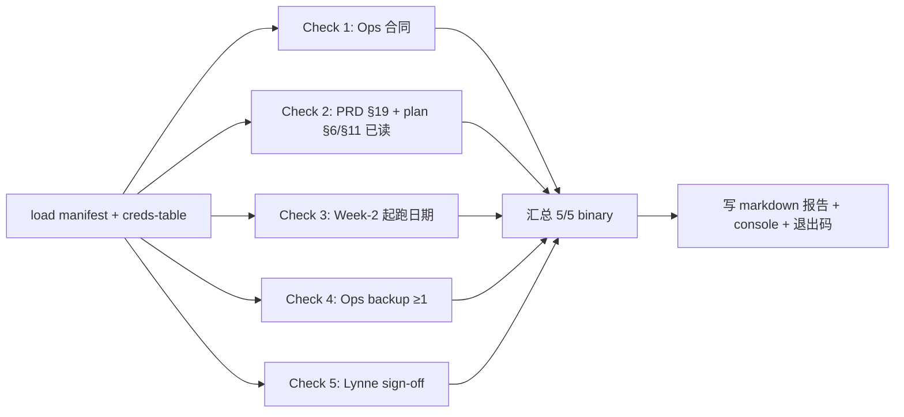

# /bin/gg-day1-gate-check 工具 spec v1

> [!info] 为什么有这个工具
> plan v1.1.2 §1.4 Day-1 18:00 是**主线 vs §1B solo-fallback** 的分叉点。判决依据是 5 条 binary criteria（合同 / PRD 已读 / 起跑日 / backup person / Lynne sign-off）。
> 当前 plan 文本里 G13 gap 指出 "4/5 vs 5/5" 文案残留不一致，**人手核对极易判错**。
> 这个工具是 RACI v1 §6 P0-3：把 5/5 binary 自动化，**wzb 18:00 只 LOOK 10 min + DECIDE 主线/§1B**。

---

## §1 30 秒读完

**输入**：plan §9 凭据登记表（YAML/JSON 摘要）+ Day-0 manifest（Lynne sign-off / Ops backup / 起跑日字段）
**输出**：单页 markdown 报告 `~/.gg-cache/day1-gate-<date>.md` + console binary 结论（`PASS 5/5` / `FAIL n/5 → §1B`）+ 退出码 0/1/2
**wzb 工作量**：Day-1 18:00 ~10 min（5 min LOOK 报告 + 5 min DECIDE 主线 vs §1B）
**Ship 时机**：W0 PM，与 `bin/gg-facts-audit` + `bin/gg-bootstrap-gcp` 同批（Claude Code 0.5h 增量，RACI v1 §6 P0-3）

---

## §2 输入

| 字段 | 来源 | 例 |
|------|------|----|
| `--manifest` | wzb cmd arg 默认 `config/day0-manifest.json` | `/Users/wzb/gengrowth-wiki/config/day0-manifest.json` |
| `--creds-table` | 默认 `config/credentials-table.yml`（plan §9 镜像）| `config/credentials-table.yml` |
| `--out` | 默认 `~/.gg-cache/day1-gate-<YYYY-MM-DD>.md` | — |
| `GG_*` env | reuse `bin/verify-gcp.mjs` 的 SA / project 加载模式 | `_gg.env` |

### 2.1 manifest.json 最简字段（wzb Day-0 手填）

```json
{
  "ops_contract_signed_at": "2026-05-21T14:30:00+08:00",
  "ops_prd_read_at": "2026-05-21T15:00:00+08:00",
  "ops_week2_start_date": "2026-05-27",
  "ops_backup_persons": ["张某某 (zhang@example.com)"],
  "lynne_kill_commit_archived_at": "2026-05-21T16:00:00+08:00",
  "lynne_kill_commit_evidence_path": "config/evidence/lynne-signoff-2026-05-21.eml"
}
```

> [!warning] Lynne sign-off 凭证检测的**最简方案**
> 不做邮件/Slack API 集成。wzb 在 manifest.json 填 `lynne_kill_commit_archived_at` 字段（ISO timestamp）+ `lynne_kill_commit_evidence_path` 指向本地存档文件。
> 工具只 check：(a) timestamp 字段非空且可解析；(b) evidence_path 文件存在且 size > 0。
> **不验证内容真伪**——这是 wzb 自我承诺的 forcing function（与 Day-0 #4 commit conversation 同 class）。

### 2.2 credentials-table.yml（plan §9 镜像）

只读用作 cross-check：3 SA JSON 路径 / GSC property / GA4 property ID / main workbook ID 是否齐。**此项不作为 5/5 binary 的必备条件**（不属于 §1.4 Pass criteria），仅在报告 §B 提示。

---

## §3 处理 pipeline（5 binary check）



### Check 1 — Ops 合同已签字（plan §1.4 line 165）

- **断言**：`manifest.ops_contract_signed_at` 是合法 ISO timestamp 且 ≤ now
- **pass**：字段非空 + 可解析 + 不在未来
- **fail**：字段缺 / null / 字符串无法 parse / 时间在未来

### Check 2 — Ops 已读 PRD §19 + plan §6 + §11（plan §1.4 line 166）

- **断言**：`manifest.ops_prd_read_at` 是合法 ISO timestamp 且 ≤ now
- **pass / fail**：同 Check 1
- **简化**：不做"考试"或"摘要校验"，wzb 信 Ops 自填（Day-0 同 manifest 时间窗内填即可）

### Check 3 — Ops Week-2 起跑日期在合同里（plan §1.4 line 167）

- **断言**：`manifest.ops_week2_start_date` 是 YYYY-MM-DD 格式 + 不晚于 plan v1.1.2 W2 标称起跑日（Day-0 + 7 天的 Mon）
- **pass**：日期可 parse + 在窗口内
- **fail**：缺字段 / "尽快开始" 等非日期字符串 / 晚于 W2 标称日

### Check 4 — Ops backup person ≥ 1（plan §1.4 line 168）

- **断言**：`manifest.ops_backup_persons` 是非空数组，且至少 1 项含联系方式（email / phone / IM ID 任一 regex match）
- **pass**：array.length ≥ 1 + 至少 1 项 contains `@` 或 `+\d` 或 IM @handle
- **fail**：缺字段 / 空数组 / 全是无联系方式的人名

### Check 5 — Lynne Day 30/60 kill 投票权 sign-off（plan §1.4 line 170 v1.1.2 新增）

- **断言**（最简方案，§2.1 已说）：
  - (a) `manifest.lynne_kill_commit_archived_at` 是合法 ISO timestamp ≤ now
  - (b) `manifest.lynne_kill_commit_evidence_path` 指向的本地文件存在 + size > 0
- **pass**：(a) 与 (b) 同时成立
- **fail**：任一不成立。**不**验证邮件 header / 不解析 IM 截图 / 不调外部 API

### §3.1 复用 verify-gcp.mjs 的 SA 加载模式

> 工具本体不调 Sheets / GSC API（5 binary 不依赖 GCP），但**启动时**仍跑一遍 verify-gcp.mjs 的 SA 加载逻辑确保 `_gg.env` 完整、3 SA JSON 文件齐 —— 写入报告 §B "环境就绪" 行，不计入 5/5 主 binary。

```js
// 实现层 reuse 模式（spec 层只描述）：
// import { loadGcpEnv, loadServiceAccount } from './lib/verify-gcp-shared.mjs';
// const env = loadGcpEnv();   // 解析 _gg.env / 缺字段 throw
// const sas = ['reader', 'writer', 'admin'].map(role => loadServiceAccount(env, role));
// 报告 §B 写：env.GCP_PROJECT_ID + 3 SA 是否齐（仅提示，不阻断主 binary）
```

---

## §4 输出

### 4.1 console（执行时 stdout）

```
[gg-day1-gate-check] 2026-05-21 18:00:12
Check 1 Ops contract signed    ........ PASS  (2026-05-21T14:30:00+08:00)
Check 2 Ops read PRD/plan       ........ PASS  (2026-05-21T15:00:00+08:00)
Check 3 Ops Week-2 start date   ........ PASS  (2026-05-27, in window)
Check 4 Ops backup persons ≥1   ........ PASS  (1 person with email)
Check 5 Lynne sign-off          ........ PASS  (archived + evidence file ok)
─────────────────────────────────────────────
RESULT: 5/5 PASS → 主线 plan 起跑
Report: ~/.gg-cache/day1-gate-2026-05-21.md
```

失败示例：

```
RESULT: 3/5 FAIL → 立刻 switch to §1B solo-fallback
Failed checks: 2 (Ops read PRD), 5 (Lynne sign-off)
Action: 参考 plan §1B.1 / §1B.2 / §1B.3
```

### 4.2 markdown 报告 `~/.gg-cache/day1-gate-<date>.md`

```markdown
# Day-1 Binary Gate Report — 2026-05-21 18:00

## §A 主 binary 结论
- **RESULT**: 5/5 PASS （主线）/ n/5 FAIL （§1B）
- **生成时间**: 2026-05-21T18:00:12+08:00
- **manifest 路径**: config/day0-manifest.json

## §B 5 项 binary 明细
| # | check | status | evidence | line ref |
|---|-------|--------|----------|----------|
| 1 | Ops 合同已签 | PASS/FAIL | `2026-05-21T14:30...` 或 失败原因 | plan §1.4 L165 |
| 2 | Ops 已读 PRD + plan | PASS/FAIL | timestamp 或 失败原因 | plan §1.4 L166 |
| 3 | W2 起跑日期 | PASS/FAIL | `2026-05-27` 或 失败原因 | plan §1.4 L167 |
| 4 | Ops backup ≥1 | PASS/FAIL | 人名 + 联系方式 或 失败原因 | plan §1.4 L168 |
| 5 | Lynne sign-off | PASS/FAIL | archived_at + evidence_path 或 失败原因 | plan §1.4 L170 |

## §C 环境就绪（提示，不阻断主 binary）
- GCP_PROJECT_ID: ___（来自 _gg.env）
- 3 SA JSON: reader ✓ writer ✓ admin ✓ / 缺哪个
- credentials-table.yml: 已读 / 缺

## §D wzb 行动建议
- 5/5 PASS → 按 plan §2 Week-1 起跑（standard-setting 8h + Claude spike）
- n/5 FAIL → 切 §1B（plan §1B.2 6 周里程碑）；**不要"明天再补"**
```

### 4.3 退出码（同 verify-gcp.mjs 风格）

| 码 | 含义 |
|----|------|
| 0 | 5/5 PASS（主线） |
| 1 | n/5 FAIL（§1B），n < 5 |
| 2 | 工具自身异常（manifest 不存在 / YAML parse 错 / IO 错），wzb 必修工具不可走 §1B |

---

## §5 wzb LOOK 节点（Day-1 18:00, 10 min）

1. **5 min LOOK** console + 报告 §A/§B
2. **5 min DECIDE**：5/5 → 主线；n/5 → §1B（按 plan §1B.1 切换，不混合主线）

**default 行为**：**无**。Day-1 binary gate 是 architectural 决策（v1.1.2 删 2/4 buffer 档），不接受 "24h 反悔"。FAIL 即 §1B。

---

## §6 Ship checklist（W0 PM Claude Code，0.5h）

- [ ] `bin/gg-day1-gate-check.mjs` 入口脚本（Node 内置 only，ES modules）
- [ ] `lib/verify-gcp-shared.mjs` 抽取 verify-gcp.mjs 的 SA 加载 + env 解析（两脚本共用）
- [ ] `--manifest <path>` `--creds-table <path>` `--out <path>` flag 解析（默认值同 §2）
- [ ] 5 个 binary check 函数各自 small + 返回 `{ pass: boolean, evidence: string, line_ref: string }`
- [ ] 报告 writer：markdown 写 `~/.gg-cache/day1-gate-<date>.md`（目录不存在自建）
- [ ] console renderer：pass 绿 / fail 红（无颜色终端 fallback 纯文本 `PASS`/`FAIL`）
- [ ] 退出码 0/1/2 分支
- [ ] **不**调任何外部 API（Sheets / GSC / Anthropic / Lynne 邮箱）
- [ ] **不**修改 manifest 或 credentials-table（只读）
- [ ] 1 个 smoke test：fixture `tests/fixtures/day1-gate/pass-5-5.json` + `fail-3-5.json` 各跑一次断言退出码 + 报告字段

---

## §7 不做（边界）

- ❌ **不自动切 §1B 路径**——决策权在 wzb（plan §1.4 v1.1.2 已锁）
- ❌ **不**发 IM / 邮件通知（Day-1 18:00 wzb 自己跑，主动 LOOK）
- ❌ **不**调外部 API 验证 Lynne 签字真伪——`evidence_path` 文件存在性即可（最简方案，§2.1 已说）
- ❌ **不**做 OCR / IM 截图解析
- ❌ **不**跑 cron——wzb 18:00 手跑（避免 timing race 与 wzb 注意力错位）
- ❌ **不**写 Sheets / 不动 git / 不动 manifest（plan Tech §3.6 红线 "脚本绝不动 git" 延伸到本工具）
- ❌ **不**做"4/5 + 24h 补救"逻辑——v1.1.2 已删此 buffer 档（plan §1.4 line 176-181）

---

## §8 Verify after ship（dry-run 验证）

W0 PM ship 后立刻跑 3 个 fixture：

```bash
# Fixture A：5/5 全 pass
node bin/gg-day1-gate-check.mjs --manifest tests/fixtures/day1-gate/pass-5-5.json
# 期望：console "5/5 PASS"，退出码 0，报告 §A RESULT = PASS

# Fixture B：Lynne sign-off 缺
node bin/gg-day1-gate-check.mjs --manifest tests/fixtures/day1-gate/fail-no-lynne.json
# 期望：console "4/5 FAIL"，退出码 1，报告 §D 建议 §1B

# Fixture C：manifest 不存在
node bin/gg-day1-gate-check.mjs --manifest /tmp/nonexistent.json
# 期望：stderr 错误，退出码 2，无报告生成
```

**accept 标准**：3 个 fixture 退出码 + 报告 §A 与期望一致。manifest 字段错拼时报告 §B 给出 line-level 提示（哪个字段缺 / 类型错），不只是 "FAIL"。

---

## §9 与 RACI v1 的链接

| RACI 项 | 关联 |
|---------|------|
| §6 P0-3 | 本 spec 是 P0-3 "ship `bin/gg-day1-gate-check`" 的实现 reference |
| §3 S-D1-1 | 本 spec 实现 S-D1-1 step：Trigger=Day-1 18:00 cron / R=AI tool / A=wzb / C=Lynne(sign-off) / I=Ops / Output=binary 报告 / Sign-off=wzb DECIDE 主线/§1B / Fallback=切 §1B |
| §1 G13 | 本 spec 修复 G13 gap "Day-1 4/5 vs 5/5 不一致"——工具只跑 5/5 binary，文档残留 4/4 不再影响执行 |
| §2 Day 1 18:00 行 | 本 spec 对应 §2 daily routine 表 Day-1 18:00 wzb 10 min "LOOK gate-check 5/5 + DECIDE 主线/§1B" |
| §1 G4 (P0-4) | 本 spec 不修 G4（Ops 退出 24h vs §1B 三档矛盾）——那是 wzb 改 markdown，不是工具职责 |

---

## §10 给 wzb 的 30 秒读法

- 你不用懂 §3-§8，那是给 Claude Code 看的
- 你要懂的就一句：**Day-1 18:00 你跑一条命令，10 秒后屏幕告诉你 5/5 还是 n/5，然后你 5 min 决定走主线还是 §1B**
- Lynne sign-off 检测方式：你 Day-0 在 `config/day0-manifest.json` 填一个时间戳 + 一个本地文件路径（邮件存档 / IM 截图 .png 都行），工具只 check 这俩字段是否齐 —— **不验证真伪**，因为这是你自己的承诺
- 5/5 之外的所有失败档（4/5, 3/5, 任一 fail）→ **全部 §1B**，没有 "明天再补" 选项（v1.1.2 锁死）
- 工具不发邮件不动 git 不切路径——只算账、只报告、只让你做决策

---

**一句话结尾**：把 plan §1.4 5 条 binary criteria 翻成 30 行 Node 脚本 + 5 min wzb LOOK + 5 min DECIDE。Day-1 18:00 分叉点从"人手核对 + G13 4/5 vs 5/5 文档歧义" → "console 一行结论 + markdown 报告 §A"。**0.5h Claude Code ship 投入，5 周省 N 次 18:00 焦虑决策。**

— day1-gate-check spec v1.0 / 2026-05-21
