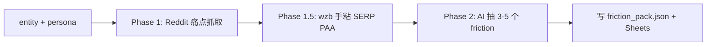

# /gg-friction-mine 工具 spec v1

> [!info] 为什么有这个工具
> 精修文章必须有「反驳 / 误区澄清」段落支撑权威感。光靠 entity 定义是不够的——还要知道**真实用户在这个 entity 上撞了什么墙、犯了什么误解、问了什么困惑**。
> 这个工具就是去 Reddit 真实社区里抓 3-5 条最有代表性的 friction（痛点 / 困惑 / 误区 / 操作障碍），原文引用 + 来源 URL 直接喂给精修 Phase 1。

---

## §1 30 秒读完

**输入**：一个 entity（如 "saturn return"）+ persona context
**输出**：3-5 个 friction 点（含 category / quote / source_url / frequency） → `friction_pack.json` 写本地缓存 + Sheets `friction_packs` tab
**wzb 工作量**：30 秒 LOOK friction_pack + DECIDE 选 3 条进精修
**Ship 时机**：W1 Mon，与 `/gg-entity-passport` + `/gg-keyword-fallback` 并行（Claude Code 0.5h 增量）

---

## §2 输入

| 字段 | 来源 | 例 |
|------|------|----|
| `entity` | wzb cmd arg `--entity` | `saturn return` |
| `persona_id` | 固定配置 `--persona-id` | `us-women-18-35-tiktok-reddit-entry` |

---

## §3 处理 pipeline（4 步，2-phase split）



### Phase 1 — 社区痛点抓取（zero AI cost）

不走 LLM API，纯 Node fetch：

| 源 | 抓什么 | 工具 | 上限 |
|----|-------|------|------|
| Reddit | `r/AskAstrologers` + `r/astrology` 30d top post 含 entity + (problem\|sucks\|terrible\|don't understand\|confused\|hate\|frustrated) | Node fetch（exact hostname: `old.reddit.com`, `np.reddit.com`） | 30 段 |
| Google SERP | wzb 手粘 `"saturn return" "I'm confused" OR "why does it" OR "doesn't make sense"` Top 10 + PAA | wzb 在 Claude 会话内贴 | 不算配额 |

> [!warning] 砍 Quora（同 keyword-fallback v1.1）
> codex security review 已决定砍 Quora（反爬 + 登录墙 + 重定向不稳）。本工具同样**只用 Reddit**。

**抓取深度**：每个 Reddit post 只取 `title + 第一段 (selftext) + top 1 comment（如有）`，**不深爬**。

**安全约束**：
- Exact hostname match（`new URL()` + `ALLOWED_HOSTS` Set）
- 拒绝 `http://`、user/password、非 443 端口、IP literal、`localhost`
- redirect 后对 `Location` 重新跑 allowlist
- sanitizer 剔除零宽 / bidi / base64 >100 / 常见 prompt injection 短语
- 30 段上限（reddit 30）

### Phase 1.5 — wzb 手粘 SERP

工具 Phase 1 结束打印提示，要求 wzb 在 Claude 会话里手粘 Google SERP top 10 + PAA。
工具本身**不调 Google SERP API**（W1 MVP zero cost）。

### Phase 2 — AI 抽 friction（wzb 手跑）

wzb 把 Phase 1 cache + 手粘 SERP 一起喂 Claude，要求：

> 从下列 Reddit + SERP 原文中，抽出 3-5 个**最有代表性的 friction 点**（用户痛点 / 困惑 / 误区 / 操作障碍）。
> 每个 friction 必须包含：
> - `category` ∈ {`misconception`, `confusion`, `fear`, `practical_block`}
> - `summary` ≤ 100 字
> - `quote` 原文引用 ≤ 200 字
> - `source_url` 必须是 reddit URL（来自 Phase 1 cache）
> - `frequency_estimate` ∈ {`high`, `medium`, `low`}
> 输出 JSON：`{"entity": "...", "friction_points": [...]}`

wzb 把 Claude 返回的 JSON 存为文件，跑 Phase 2 ingest：

```bash
node tools/scripts/gg-friction-mine.mjs --entity "saturn return" --ingest ~/.gg-cache/friction-mine-<ts>-step2.json
```

### Phase 2 处理

工具读 ingest JSON → schema 校验 → 写 `friction_pack.json` cache + Sheets `friction_packs` + `runs` 表。

---

## §4 输出

### 4.1 本地 cache

```
~/.gg-cache/friction-mine-<ts>-step1.json   # Phase 1 raw corpus
~/.gg-cache/friction-mine-<ts>-out.json     # Phase 2 final friction_pack
```

### 4.2 friction_pack.json schema

```json
{
  "run_id": "2026-05-21T...",
  "entity": "saturn return",
  "persona_id": "us-women-18-35-tiktok-reddit-entry",
  "generated_at": "ISO timestamp",
  "friction_points": [
    {
      "category": "misconception",
      "summary": "Users think saturn return is just about turning 29",
      "quote": "I thought saturn return only happens at 29...",
      "source_url": "https://old.reddit.com/r/AskAstrologers/...",
      "frequency_estimate": "high"
    }
  ]
}
```

**校验**：
- 必须 3-5 条 friction_points
- `category` ∈ enum 4 项
- `frequency_estimate` ∈ enum 3 项
- `source_url` 必须 isAllowedUrl()（reddit 域名）
- 缺 `source_url` 或 url 不在 allowlist → graceful skip 该条（warn），不阻断
- `summary` ≤ 200 chars，`quote` ≤ 400 chars

### 4.3 Sheets `friction_packs` tab

| Col | 字段 | 来源 |
|-----|------|------|
| A | ts | 时间戳 |
| B | entity | wzb arg |
| C | friction_count | Phase 2 |
| D | top_category | Phase 2 出现最多的 category |
| E | file_path | `~/.gg-cache/friction-mine-<ts>-out.json` |
| F | status | `ok` / `partial` |
| G | notes | 错误码 + 截 80 字（redacted） |

`valueInputOption=RAW` 强制（同 keyword-fallback）。

### 4.4 Sheets `runs` 表

同 keyword-fallback 写法，append 1 行：
`[ts, tool, entity, friction_count, top_category, status, notes]`

---

## §5 wzb LOOK 节点（30 秒）

W1 Mon PM 自动触发后，wzb 打开 `friction_pack.json`（或 Sheets `friction_packs` tab）：

1. 看 3-5 个 friction summary
2. DECIDE 选 3 条最有代表性的进精修
3. 把选中的 3 条 paste 到精修 Phase 1 Friction 段落
4. 完成

**fallback**：如果 Phase 1 抓不到任何 Reddit post（403 / 0 结果），**escalate wzb 手抓**（不再自动跳过，符合 Tech §4.2「SERP 0 结果 → wzb manual review 介入」）。

---

## §6 Ship checklist（W1 Mon Claude Code）

- [ ] `tools/scripts/gg-friction-mine.mjs` 入口脚本
- [ ] 复用 keyword-fallback 全部 helpers（env loader / SA token / isAllowedUrl / sanitize / redact / errorCode / validateIngestPath / Sheets helpers）
- [ ] Exact hostname allowlist 写死 = `{old.reddit.com, np.reddit.com}`
- [ ] Reddit 抓取：每 sub 15 post 上限，每 post 取 `title + selftext 首 400 字 + 不深爬`
- [ ] Phase 2 ingest path traversal 防护：`realpathSync` + 必须落在 `~/.gg-cache/` + `.json` + ≤1MB
- [ ] Phase 2 schema 校验：3-5 friction，4 category enum，3 frequency enum，URL isAllowedUrl
- [ ] 缺 source_url 或 URL 不在 allowlist → graceful skip 该条
- [ ] Sheets writer 走 `gg-writer-sa`，valueInputOption=RAW
- [ ] dry-run 模式 `--dry-run` 不写 Sheets，只 console 输出
- [ ] secret/error redact（同 keyword-fallback）
- [ ] runs 表 append
- [ ] smoke test：SSRF allowlist、schema enum、ingest path traversal、缺 source_url graceful skip

---

## §7 不做（明确边界）

- ❌ 不爬 Quora（codex 决定）
- ❌ 不调 LLM API（Phase 2 由 wzb 在 Claude 会话内手跑）
- ❌ 不调 Google SERP API（W1 MVP zero cost；wzb 手粘）
- ❌ 不写 article draft（这工具只产 friction_pack，精修 Phase 1 才组装）
- ❌ 不跑 cron（wzb cmd 触发）

---

## §8 Verify after ship

```bash
node tools/scripts/gg-friction-mine.mjs --entity "saturn return" --dry-run
```

期望：
- Phase 1 抓 ≤30 段 Reddit 痛点
- 写 `~/.gg-cache/friction-mine-<ts>-step1.json`
- 打印 Phase 2 prompt 提示
- 总耗时 < 1 min
- 总成本 = $0（zero cost Phase 1）

**accept 标准**：抓到的 30 段里至少有 5 段明显含 problem/confused/hate 词。如果 0 段 → fallback `wzb 手抓`。

---

## §9 与 RACI v1 的链接

| RACI 项 | 关联 |
|---------|------|
| §3 S-W1-2 | 本 spec 是 W1 Mon PM Friction 取证的 AI 薄版实现 |
| §6 P1-1 | 本 spec 是 P1-1 中 `/gg-friction-mine` 的实现指引 |
| §2 W1 Mon PM | wzb LOOK quotes 候选 + DECIDE 选 3 条 → 对应本 spec §5 |

---

## §10 给 wzb 的 30 秒读法

- 你不用懂 §3-§6 实现，那是给 Claude Code 看的
- 你要懂的就一句：**W1 Mon PM 你会看到 3-5 个 friction 点，每个含原文引用 + URL，30 秒 DECIDE 选 3 条进精修**
- 这 3 条直接喂精修文章「误区澄清」段落
- 数据来源：Reddit + 你在 Claude 里手粘的 Google SERP（同 keyword-fallback）
