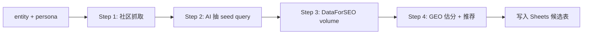

# /gg-keyword-fallback 工具 spec v1

> [!info] 为什么有这个工具
> astrologywiki.com 30d GSC 实测 **几乎没流量**（site total ~250 imp，唯一 ≥100 imp 的 query 是品牌词 "astrology wiki"）。
> → 原 plan 中 "W1 从 GSC top 30 query 找低垂果实" 路径在 cold-start 站点上**直接失效**。
> → 这个工具是 **zero-baseline keyword discovery** 的 default path，不依赖站点已有流量。

---

## §1 30 秒读完

**输入**：一个 entity（如 "saturn return"）+ persona context（美国 18-35 女性, TikTok/Reddit 入门者）
**输出**：20 候选 keyword + GEO 估分 + 推荐 5 ★ → 写入 Sheets `keyword_candidates` 候选表
**wzb 工作量**：30 秒 LOOK 候选表 + 5 个 ★ batch approve
**Ship 时机**：W1 Mon，与 `/gg-entity-passport` + `/gg-friction-mine` 并行（Claude Code 0.5h 增量）

---

## §2 输入

| 字段 | 来源 | 例 |
|------|------|----|
| `entity` | wzb cmd arg | `saturn return` |
| `persona_id` | 固定配置 | `us-women-18-35-tiktok-reddit-entry` |
| `target_count` | 默认 20 | `20` |
| `gsc_context` | optional, `bin/gg-fetch-gsc.mjs --site $GG_GSC_SITE --days 30` 返回 | `{}` (empty 也 ok, 工具不依赖) |

---

## §3 处理 pipeline（4 步）



### Step 1 — 社区抓取（zero-baseline 关键）

不依赖 GSC，直接从用户聚集的 **2 个**社区抓真实 query：

| 源 | 抓什么 | 工具 | 比例 |
|----|-------|------|------|
| Reddit | r/AskAstrologers + r/astrology 30d top post title | Node fetch（exact hostname: `old.reddit.com`, `np.reddit.com`）| 15 段 |
| Google SERP | `"saturn return" + persona keyword` Top 10 + "People Also Ask" | wzb 在 Claude 会话内手粘 SERP 结果到 Phase 1 提示 | 15 段 |

> [!warning] 2026-05-21 v1.1 砍 Quora
> 原 v1.0 列了 Quora 第 3 源，codex review 后砍：Quora 反爬 + 登录墙 + URL 重定向不稳定，收益不配复杂度。Reddit + Google SERP 双源对 cold-start MVP 已足够。

**安全约束**（codex review v1.1 强化）：
- **Exact hostname match**（非 subdomain 通配）：用 `new URL()` 解析 + hostname 严格 in `ALLOWED_HOSTS` Set
- 拒绝 `http://`、user/password、非 443 端口、IP literal、`localhost`
- 每次 fetch redirect 后对 `Location` 重新跑 allowlist 校验
- Sanitizer 剔除零宽/bidi/base64 >100 块/常见 prompt injection 短语；keyword tool 不执行命令所以风险面有限（codex 评：sanitizer 别过度工程）
- Reddit 内容只取 title + 第一段，不深爬

### Step 2 — AI 抽 seed query

把 Step 1 的原文喂给 Claude/sonnet：

> 从下列 30 段社区原文中，抽出**普通用户实际会去 Google 搜的 query**，每个 ≤6 词，包含 entity "saturn return"。
> 要求：
> - 排除品牌词（"astrologywiki", "co-star" 等）
> - 排除 dictionary lookup（"what is saturn return"，因为这种 Wikipedia 永远霸榜）
> - 偏好"困惑/实操/对比"型 query（如 "saturn return job change", "saturn return age 29 reddit"）
> - 输出 20-30 个候选，去重

### Step 3 — DataForSEO volume 拉取

每个候选 query 调一次 DataForSEO API：

| 字段 | 含义 |
|------|------|
| `search_volume` | US monthly average |
| `keyword_difficulty` | 0-100 |
| `cpc` | $（用于推断商业化潜力）|
| `serp_features` | "people_also_ask" / "ai_overview" / "featured_snippet" 标记 |

**预算**：20 query × $0.0006 = $0.012 / 跑，远低于 $500 月预算。

### Step 4 — GEO 估分公式 + 推荐

GEO score 公式（已在 Tech §4 定义）：

```
GEO = 0.4 × (volume/1000) + 0.3 × (1 - KD/100) + 0.2 × log_ranking_chance + 0.1 × ai_overview_present
```

按 GEO 降序排，标 Top 5 为 ★（默认推荐）。

---

## §4 输出 → Sheets `keyword_candidates` 表

| 列 | 字段 | 来源 |
|----|------|------|
| A | run_id | timestamp |
| B | entity | wzb arg |
| C | query | Step 2 抽取 |
| D | source | reddit / serp |
| E | search_volume | Step 3 |
| F | keyword_difficulty | Step 3 |
| G | cpc | Step 3 |
| H | serp_features | Step 3 |
| I | geo_score | Step 4 |
| J | ai_recommend | Step 4 (★ if Top 5) |
| K | wzb_approve | wzb LOOK 时手 FILL ★ |
| L | notes | optional |

**valueInputOption=RAW 强制**（Tech §5 已规定）。
公式列硬禁写（本表无公式列，I 列由工具计算后写 RAW 值）。

---

## §5 wzb LOOK 节点（30 秒）

W1 Fri 17:00 自动触发后，wzb 打开 Sheets `keyword_candidates` 表：

1. 看 J 列 ★ AI 推荐的 Top 5（已按 GEO 降序）
2. 30 秒判断：是否符合 persona "美国 18-35 女性, TikTok/Reddit 入门"？
3. K 列 FILL 2 个 ★（W2 选题 2 篇）
4. 完成

**default 行为**：如果 wzb 24h 内不 FILL K 列，AI 默认采用 J 列前 2 个 ★ 作为 W2 选题（24h 反悔 window，与 §1 G3 default + 反悔 模式一致）。

---

## §6 Ship checklist（W1 Mon Claude Code）

- [ ] `tools/scripts/gg-keyword-fallback.mjs` 入口脚本
- [ ] 复用 `bin/gg-fetch-gsc.mjs` SA 凭据加载（即使 GSC 数据为空也跑通）
- [ ] Exact hostname allowlist 写死（`ALLOWED_HOSTS = new Set(['old.reddit.com', 'np.reddit.com'])`），`isAllowedUrl()` helper 用 `new URL()` 解析；smoke test 覆盖 SSRF 攻击向量（subdomain attack `old.reddit.com.evil.com`、@-trick、user info、非 443、IP literal、localhost、`http://`）
- [ ] DataForSEO API key 走 `~/.config/gg/_gg.env` 的 `GG_DATAFORSEO_LOGIN` + `GG_DATAFORSEO_PASSWORD`（**不进 git**）
- [ ] Sanitizer fixture（中/韩/阿/base64/零宽空格/leetspeak）跑通
- [ ] Sheets writer 走 `gg-writer-sa`，valueInputOption=RAW，目标 sheet 必须存在
- [ ] dry-run 模式 `--dry-run` 不写 Sheets，只 console 输出 20 候选 + GEO
- [ ] 错误处理：DataForSEO 限额 / Reddit 403 都要 graceful degrade（标 source=unavailable, 不阻断）
- [ ] **`--ingest <file>` path traversal 防护**：`realpathSync` 解析 + 必须落在 `~/.gg-cache/` 内 + `.json` 扩展名 + ≤1MB + JSON schema 校验（array of `{query: string ≤200, source: 'reddit'|'serp'}`, ≤100 项）
- [ ] **secret redact**：所有 console.log/error 走 `redact()` helper（剥 Bearer/Basic/private_key/client_email/长 token-like 串）；runs 表 notes 列额外做 `errorCode()` → 短代码 `ERR_NETWORK|ERR_AUTH|ERR_PARSE|ERR_VALIDATION|ERR_OTHER` + 截 80 chars，不写原始异常
- [ ] runs 表 append：`runs!A:G` 写 1 行 `[ts, tool, entity, query_count, geo_top5, status, notes]`
- [ ] 1 个 vitest smoke：mock DataForSEO 返回 → 验证 GEO 公式 + Sheets 写入

---

## §7 不做（明确边界）

- ❌ 不爬 TikTok（API 限制 + Sanitizer 风险）→ TikTok 数据走 Step 1 SERP 间接获取
- ❌ 不跑 cron（wzb cmd 触发，避免 GSC quota 莫名烧）
- ❌ 不接 perplexity API（W4 P3-1 才 ship `bin/gg-ai-citation-check`）
- ❌ 不做 cluster（W3 S-W3-3 才有 cluster proposer）
- ❌ 不写 manifest.json（这工具只产候选词，不产 content draft）

---

## §8 Verify after ship

W1 Mon ship 后，wzb 手跑一次 dry-run 验证：

```bash
node tools/scripts/gg-keyword-fallback.mjs --entity "saturn return" --dry-run
```

期望输出：
- Step 1 抓 30 段原文（reddit 15 + serp 15）
- Step 2 输出 25 候选 query
- Step 3 DataForSEO 25 调用成功
- Step 4 Top 5 GEO 排序 + 推荐
- 总耗时 < 2 min
- 总成本 < $0.02

**accept 标准**：Top 5 中至少 3 个 query 是 wzb 凭直觉认为"persona 真的会搜"的。如果 5 个都不像，说明 persona prompt 错了（不是工具错），需要重调 Step 2 system prompt。

---

## §9 与 RACI v1 的链接

| RACI 项 | 关联 |
|---------|------|
| §1 G2 改造列 | 本 spec 是 G2 升级后的实现 reference |
| §2 W1 Fri 行 | 本 spec 的 wzb LOOK 节点对应 §2 W1 Fri 的 10 min |
| §3 S-W2-2 fallback 列 | 本 spec 是 fallback 路径的真实工具 |
| §6 P1-1 | 本 spec 是 P1-1 中新增的 `/gg-keyword-fallback` 实现指引 |

---

## §10 给 wzb 的 30 秒读法

- 你不用懂 §3-§6 的实现细节，那是给 Claude Code 看的
- 你要懂的就一句：**W1 Fri 你会看到 Sheets 上有 20 个候选词 + AI 标了 ★ 5 个，你 30 秒挑 2 个，进 W2 写**
- 候选词从哪来：Reddit + Google SERP（不是你站点的 GSC，因为 GSC 是空的）
- 你不需要做任何 Google 手搜——工具帮你做完
