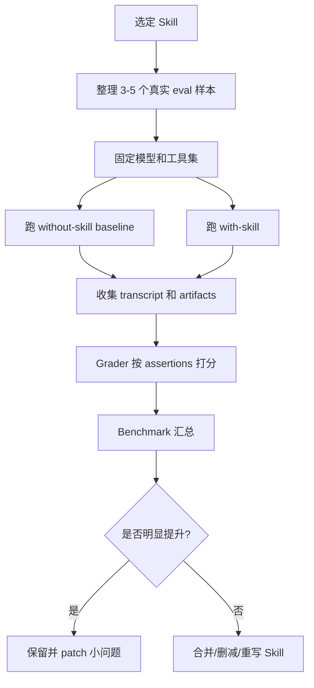

# GenGrowth Skill Eval MVP 技术方案

> [!info] 一句话结论
> 这份方案把 Anthropic `skill-creator` 的评测思路，落成 GenGrowth 自己可执行的 Skill 评测 MVP：先选 1 个高频 Skill，写 3-5 个真实任务样本，同时跑 with-skill / without-skill，对比质量、遗漏、返工和耗时，再决定 Skill 是否值得保留、合并或重写。

## 0. PM 结论

| 判断项 | 结论 |
|---|---|
| 是否值得做 | 值得做，P0 内部 dogfood |
| 第一目标 | 先验证 `gengrowth-wiki-gbrain` 这类高频 Skill 是否真的降低剪藏、沉淀、GBrain 同步和 record 补尾的遗漏率 |
| 不先做什么 | 不做大而全 Skill 平台；不接入所有 bot；不追求自动优化 Skill |
| 最小可验收 | 3-5 个真实任务样本，完成一轮 with/without 对照评测，并产出 benchmark 报告和 skill patch 建议 |

> [!warning] 边界
> Skill Eval 的目标不是证明“有 Skill 一定更好”，而是找出 Skill 到底在哪些场景有价值、在哪些场景触发错误、哪些内容已经变成负担。

## 1. 用户、场景、痛点

| 维度 | 内容 |
|---|---|
| 用户 | 彪哥 / PM Assistant / Hermes BotOps / 后续客户 Agent 团队 |
| 场景 | 高频处理剪藏、PRD、wiki/gbrain 沉淀、Kanban 协作、Skill Library 维护 |
| 痛点 | Skill 越写越多，但不知道哪些真的提升结果；description 触发不稳定；Skill 内容过长导致噪音；成功经验没有量化 |
| 当前替代方案 | 靠人工经验判断；任务失败后临时 patch；没有 baseline 对照 |
| 产品机会 | 内部先形成 `Skill Library Quality Review` 服务包，后续可给客户做 Agent Skill 体检 |

## 2. MVP 范围

### 2.1 P0 只评一个 Skill

建议第一个对象：`gengrowth-wiki-gbrain`

原因：

1. 高频：几乎所有情报沉淀、微信剪藏、wiki/gbrain 同步都会用到。
2. 结果可验证：文件是否存在、log 是否追加、gbrain 是否 get/search 可读、record 是否补写，都能检查。
3. 风险可控：先在内部资料流试，不涉及客户承诺。
4. 能反哺当前主线：AI Builder 情报产品化、Wiki/GBrain 资产化、PM 协作流都依赖它。

### 2.2 P0 不做的事

| 不做 | 原因 |
|---|---|
| 不做全量 Skill Library 评分 | 样本不足，容易变成文档审查而不是真实任务评测 |
| 不自动改 Skill | 自动 patch 容易引入错误，第一版只输出建议，人工确认后再改 |
| 不做跨模型大 benchmark | 成本高，变量多；先固定当前主模型和当前工具集 |
| 不做复杂 UI | Markdown 报告 + JSON 结果足够验证价值 |

## 3. 输入与输出

### 3.1 输入

| 输入 | 说明 | 示例 |
|---|---|---|
| Skill 文件 | 被评测的 `SKILL.md` 和 references/templates/scripts | `gengrowth-wiki-gbrain/SKILL.md` |
| Eval 样本 | 真实用户任务，不是为测试硬造的 prompt | “保存这篇微信公众号并同步 gbrain” |
| 任务上下文 | 必要链接、目标路径、验收要求 | 微信链接、目标 wiki 路径、slug |
| 工具权限 | 固定工具集，避免 with/without 变量太多 | browser / terminal / file / skill |
| 期望断言 | 客观可检查的完成标准 | “必须追加 LLM-Wiki/log.md” |

### 3.2 输出

| 输出 | 验收标准 |
|---|---|
| `evals.json` | 3-5 个真实任务样本，每个包含 prompt、context、expected_artifacts、assertions |
| `with_skill` 结果 | 带目标 Skill 跑完任务，保存 transcript / artifact / metrics |
| `without_skill` 结果 | 不加载目标 Skill，仅靠通用规则跑同一任务 |
| `grading.json` | 每条断言 PASS / FAIL / UNKNOWN，并附证据 |
| `benchmark.md` | 汇总差异、失败模式、是否建议保留/合并/改写 Skill |
| `patch_proposal.md` | 只给建议，不自动写入，除非彪哥确认 |

## 4. 目录结构建议

```text
skill-evals/
  gengrowth-wiki-gbrain/
    2026-05-19-v0/
      evals.json
      runs/
        eval-001/
          with_skill.md
          without_skill.md
          artifacts.json
        eval-002/
          with_skill.md
          without_skill.md
          artifacts.json
      grading.json
      benchmark.md
      patch_proposal.md
```

说明：

- `evals.json` 存任务定义。
- `runs/` 存每次执行记录。
- `grading.json` 存逐项评分。
- `benchmark.md` 给人看，直接进入 wiki。
- `patch_proposal.md` 给 PM 决定是否更新 Skill。

## 5. Eval 样本设计

P0 建议 5 类样本：

| 样本 | 任务 | 重点验证 |
|---|---|---|
| E1 微信公众号剪藏 | 用户只发微信链接，要求自动解析保存 | 是否查重、抓取、区分事实/PM 判断、同步 gbrain、补 record |
| E2 派生技术文档 | 用户确认“可以”，要求把上轮方案写入 Tech | 是否不重复问路径、是否按补尾流程执行 |
| E3 GBrain 异常 | `gbrain put/get` 超时或报错 | 是否不谎称成功、是否标记待复核 |
| E4 record 补尾 | 上下文压缩后只剩 record 待补 | 是否读取当天尾部、编号连续、避免只回 record 回执 |
| E5 重复链接冲突 | 当前链接和历史标题不一致 | 是否重新核对、避免误判重复 |

### 5.1 `evals.json` 最小模板

```json
{
  "skill_name": "gengrowth-wiki-gbrain",
  "version": "v0.1",
  "evals": [
    {
      "id": "E1-wechat-clipping",
      "prompt": "https://mp.weixin.qq.com/s/example",
      "context": "用户长期偏好：低风险链接可直接解析、保存、补 PM 判断。",
      "expected_artifacts": [
        "LLM-Wiki/Notes/Clippings/<title>.md",
        "LLM-Wiki/log.md",
        "gbrain slug",
        "docs/records/wzb/YYYY-MM-DD-chat-record.md"
      ],
      "assertions": [
        "重新打开当前链接并核对标题、公众号、发布时间、正文开头",
        "剪藏中区分事实、官方确认、PM 判断",
        "gbrain put 后必须 get 或 search 验证；失败要标记待复核",
        "最终回复不能只有 record 回执"
      ]
    }
  ]
}
```

> [!tip] 评测样本要像真实用户说话
> 不要写成“请调用 browser_navigate 再执行 gbrain put”。真实用户只会发链接、截图或一句“可以”。Skill 应该帮助 Agent 补齐流程，而不是靠测试 prompt 明示步骤。

## 6. 评分标准

### 6.1 单条断言评分

| 分数 | 含义 | 规则 |
|---|---|---|
| PASS | 有证据完成 | 必须能指向文件、slug、命令输出或回复内容 |
| FAIL | 明确没完成或做错 | 漏步骤、误报成功、路径错误、权限越界 |
| UNKNOWN | 证据不足 | 默认不算通过；需要补验证 |

### 6.2 汇总指标

| 指标 | 解释 | P0 目标 |
|---|---|---|
| 断言通过率 | PASS / 总断言数 | with-skill ≥ 80%，且高于 without-skill 20 个百分点 |
| 严重错误数 | 误报成功、覆盖文件、泄露敏感信息、权限越界 | 0 |
| 补尾完成率 | log / gbrain / record 三件套是否完成 | with-skill ≥ 80% |
| 返工次数 | 同一任务因漏步骤需要用户提醒的次数 | with-skill 比 without-skill 少 |
| 耗时/工具调用 | 完成任务所需时间和工具调用数 | 不强求最低，但不能为质量提升付出 3 倍成本 |

## 7. 评测流程



### 7.1 执行步骤

1. 固定评测对象：`gengrowth-wiki-gbrain` 当前版本。
2. 从真实历史任务中抽 3-5 个 prompt，去掉敏感信息。
3. 为每个 prompt 写 `assertions`，每条必须可验证。
4. 先跑 `without_skill`：不主动加载目标 Skill，只用全局规则。
5. 再跑 `with_skill`：按当前规则加载目标 Skill。
6. Grader 检查产物，不看“回答说自己完成了”，只看证据。
7. 输出 `benchmark.md` 和 `patch_proposal.md`。
8. 彪哥确认后再 patch Skill。

## 8. Grader 断言清单

以 `gengrowth-wiki-gbrain` 为例，P0 Grader 至少检查：

| 类别 | 断言 |
|---|---|
| 路径 | 是否写入正确目录，Tech/Knowledge/Writing 是否有英文首字母前缀 |
| 查重 | 是否在创建前搜索已有文件或已有 slug |
| 来源 | 是否区分原文事实、官方确认、PM 判断 |
| GBrain | 是否使用 `HOME=/Users/awayer_mini gbrain put <slug>`，并 get/search 验证 |
| 错误处理 | gbrain 失败时是否明确待复核，而不是说成功 |
| Log | 是否追加 `LLM-Wiki/log.md`，包含路径、内容、slug、验证状态 |
| Record | 是否追加当天 record，用户原文完整保留，回答摘要包含关键路径和验证结果 |
| 最终回复 | 是否给用户可验收结果，而不是只回“已记录” |
| 权限 | 是否避免外发、删除、覆盖、配置变更等高风险动作 |

## 9. 负责人和优先级

| 工作 | 负责人 | 优先级 | 验收标准 |
|---|---|---|---|
| P0 eval 样本收集 | 彪哥 + PM Assistant | P0 | 3-5 条真实任务，脱敏后可复跑 |
| Eval 文件生成 | PM Assistant / Hermes | P0 | `evals.json` 可读，断言可验证 |
| 跑 with/without 对照 | Hermes / BotOps | P0 | 每个样本都有两组结果和 artifacts |
| Grader 评分 | PM Assistant 初评，彪哥抽检 | P0 | 每条 FAIL 有证据，不凭感觉 |
| Skill patch 决策 | 彪哥 | P0 | 明确保留、合并、重写或删除 |
| 对外服务包包装 | 玲姐决策，彪哥出方案 | P1 | 有定价、交付范围、客户样本后再做 |

## 10. MVP 验收标准

P0 算完成，必须满足：

1. 完成 1 个 Skill 的 3-5 个 eval 样本。
2. 每个样本都有 with-skill / without-skill 对照结果。
3. 每个结果都有 Grader 断言评分。
4. Benchmark 明确回答：这个 Skill 是否真的提升结果？提升在哪里？代价是什么？
5. 输出一份 patch 建议，但不自动修改 Skill，除非彪哥确认。
6. 形成一个可复用模板，能迁移到 PM / Ops / CEO / Hermes 其他 Skill。

## 11. 风险与止损

| 风险 | 表现 | 止损方式 |
|---|---|---|
| 评测样本太少 | 结论偶然性强 | P0 只作为内部判断，不对外宣传 |
| Eval 被 prompt 污染 | 测试 prompt 明示答案 | 使用真实用户表达，并保留 should-not-trigger 样本 |
| Grader 过宽 | 表面格式正确就 PASS | 断言必须绑定证据，不确定默认 UNKNOWN |
| Skill 越改越长 | 新增规则堆叠，触发噪音变大 | 每次 patch 必须删除或合并旧规则 |
| 自动化误报成功 | GBrain / record 未验证却回复完成 | 把“误报成功”设为严重错误，直接 FAIL |

## 12. 后续产品化机会

| 服务包 | 目标客户 | 交付物 |
|---|---|---|
| Skill Library Quality Review | 已有 Agent Skills / SOP prompt 的团队 | Skill inventory、触发审计、eval 样本、benchmark、patch 建议 |
| Agent Harness Readiness Sprint | 想把 Demo 变成稳定 Agent 的团队 | Harness Checklist、任务闭环、工具权限、安全边界、评测方案 |
| AI Builder Workflow Benchmark | AI Builder / 独立开发者 | workflow baseline、with/without 对照、可复用模板 |

PM 判断：先内部 dogfood，不急着对外卖。等我们能拿出 2-3 个内部 Skill 的 benchmark，再包装成服务包更可信。

## 13. 下一步

1. 先以 `gengrowth-wiki-gbrain` 建立第一组 `evals.json`。
2. 从最近 7 天剪藏 / GBrain / record 补尾任务中挑 5 个真实样本。
3. 跑一轮人工半自动 benchmark，不追求系统自动化。
4. 根据结果决定：保留现 Skill、拆分 references、压缩主 `SKILL.md`，还是合并重复规则。
5. 如果 P0 成立，再评测 `hermes-agent`、`gengrowth-agent-team`、`kanban-worker` 三个高影响 Skill。

## 相关阅读

- [[Anthropic：通过评测把 Skill 变成可迭代资产]] — 官方 `skill-creator` 思路和来源核验。
- [[GenGrowth Agent Harness Review Checklist]] — 判断 Agent / Skill 是否可交付的八关清单。
- [[GenGrowth Agent PRD 标准模板]] — 把 Agent 想法变成可实验、可验收任务的 PRD 模板。
- [[G-GenGrowth-AI-Coding-Harness-Self-Check-Checklist]] — 把 AI 编程规则、规则文件、测试和 checkpoint 转成内部仓库自查表。
