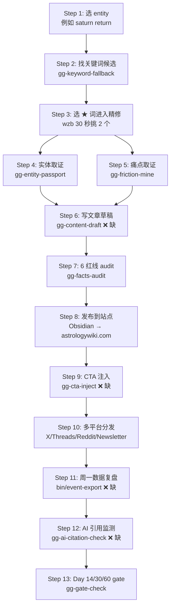

# GenGrowth 精修文章 — 端到端 SOP v1

> [!warning] 2026-05-21 — 待按 Lynne 三档对齐重写（不是 deprecated，是待升级）
> 本文档方向对的（替代 RACI 企业风格 / 关注 step 输入输出），但写作时**没读 Lynne 的 PRD v0.7 + keyword-research-sop v2.5 + keyword-sheet-setup.gs v3.1**，因此：
> - 没接 6-ID 体系（cluster_id / page_id / cta_id / outcome_id）
> - 没区分量产线 / 精修线
> - 没用 5 种 page_role / 5 种 Template / 3 种 Tier
> - 没接 Lynne 13 张表的 _staging/{page_id}/ 输出路径
>
> Canonical 文档：
> - `docs/03-marketing/03-seo/keyword-research-sop.md` v2.5
> - `docs/03-marketing/03-seo/keyword-sheet-setup.gs` v3.1
> - `docs/03-marketing/2026-05-15-gengrowth-internal-growth-mvp-prd-v0.7.md`
>
> v2 重写计划：在 gg-content-draft 极简版 ship 完之后，按上述 3 档对齐重写本 SOP。当前版本**仅作"端到端 step 流"的骨架参考**。

> 这份文档替代 RACI / PRD 那一套企业风格。
> **目的**：让任何人（wzb / Lynne / Ops）打开就能懂 "一篇精修文章从想法到发布到复盘的完整流程是什么"。
> **不写**：谁是 R / 谁是 A / 谁是 C / 谁是 I（小团队不需要）。
> **写**：每个 step 输入是什么、用什么工具、输出是什么、跟下一个 step 怎么衔接。

---

## §1 现在到哪了（2026-05-21 阶段定位）

**我们在做的事**：英文占星 wiki（astrologywiki.com）的 SEO MVP。目标是 5 周内验证「精修文章」策略 — 不是量产长尾，是单篇做透 → 拿 Top 10 排名 + 被 AI Overview / Perplexity 引用。

**站点现状（GSC 实测 2026-05-21）**：
- 30 天全站总曝光 ≈ 250 imp
- 唯一过 100 imp 的 query 是品牌词「astrology wiki」
- 唯一过 100 imp 的页面是 `/en/wiki/best-astrology-mental-health-apps`
- 其他所有 query <5 imp
- **冷启动状态**：不能从 GSC 找低垂果实，需要从 0 开始挖关键词

**工具 ship 进度**：

| 模块 | 工具 | 状态 |
|------|------|------|
| 找关键词 | `gg-keyword-fallback` | ✅ ship（49 smoke pass）|
| 实体取证 | `gg-entity-passport` | ✅ ship（56 smoke pass）|
| 痛点取证 | `gg-friction-mine` | ✅ ship（46 smoke pass）|
| **写文章草稿** | **`gg-content-draft`** | ❌ **没 ship — 当前最大瓶颈** |
| 6 红线 audit | `gg-facts-audit` | ✅ ship（39 smoke pass）|
| CTA 注入 | `gg-cta-inject` | ❌ 没 ship（W4 task）|
| 发布回填 | `bin/publish-backfill` | ❌ 没 ship（W4 task）|
| 数据复盘 | `bin/event-export` | ❌ 没 ship（W3 task）|
| AI 引用监测 | `bin/gg-ai-citation-check` | ❌ 没 ship（W4 task）|
| Day-1/14/30/60 gate | `gg-day1-gate-check` + `gg-gate-check` | ✅ ship（19 + 40 pass）|
| Ops SOP 生成 | `gg-sop-draft` | ✅ ship（18 pass + 5 SOP draft）|

**一句话结论**：找关键词 + 取证 全齐，**写文章工具缺**，发布/复盘工具全缺。下一步就是把 `gg-content-draft` ship 出来。

---

## §2 端到端流程图



**Step 1-7 是「写出一篇精修」的流程**，平均 4-5h / 篇（wzb 主力，Ops 在 Step 4-5 协助拉数据）。
**Step 8-13 是「发布后的运营」**，per 篇平均 2-3h / 月（Ops 主力，wzb 周一/周二 30 min 决策）。

---

## §3 单 step 详解（13 个 step 逐一展开）

> 格式：每个 step 6 个字段 — 触发 / 输入 / 工具 / 怎么做 / 输出 / 跟下个 step 怎么接

### Step 1 — 选 entity

**触发**：每周一上午（wzb 决定本周做哪个主题）
**输入**：你的脑子 + 上周 retro 的反馈
**工具**：无（人工决策）
**怎么做**：从已有积压主题列表（例如「土星回归」「火星在天蝎」「行星逆行」）里挑 1 个；或基于 Reddit / TikTok 看到的新趋势临时加
**输出**：1 个 entity 字符串（例如 `"saturn return"`）
**衔接 Step 2**：把 entity 喂给 `gg-keyword-fallback`

### Step 2 — 找关键词候选

**触发**：拿到 Step 1 的 entity
**输入**：entity（如 `"saturn return"`）
**工具**：`gg-keyword-fallback`（已 ship）
**怎么做**：
```bash
node tools/scripts/gg-keyword-fallback.mjs --entity "saturn return"
```
工具会 Phase 1 抓 Reddit + 你手粘 Google SERP 的结果 30 段 → 喂 Claude 抽 20-30 候选 query → DataForSEO 拉 volume → 算 GEO 分 → 推荐 Top 5
**效能**：5 分钟（Phase 1 抓取 2 分钟 + 你喂 Claude 1 分钟 + Phase 2 跑 2 分钟）
**输出**：Google Sheets `keyword_candidates` tab 新增 20 行候选 + Top 5 标 ★ + 一份 csv
**衔接 Step 3**：你打开 Sheets 看 20 候选

### Step 3 — 选 ★ 词进入精修

**触发**：Step 2 跑完
**输入**：Sheets `keyword_candidates` 表 20 候选
**工具**：Google Sheets（无脚本，纯人工）
**怎么做**：看 AI 推荐的 ★5 个，30 秒判断哪 2 个最像你 persona（美国 18-35 女性 TikTok/Reddit 入门）会搜，在 K 列填 ★
**效能**：30 秒。如果 24h 内不填，工具默认采用 Top 2
**输出**：2 个 keyword 进入本周精修（例如 `"saturn return at 28"` + `"saturn return job change"`）
**衔接 Step 4 + 5**：用这 2 keyword 启动取证

### Step 4 — 实体取证

**触发**：选定 keyword 后
**输入**：keyword（entity 一般跟 keyword 的核心词重合）
**工具**：`gg-entity-passport`（已 ship）
**怎么做**：
```bash
node tools/scripts/gg-entity-passport.mjs --entity "saturn return"
```
工具去 Wikipedia + astro.com + cafeastrology + chaninicholas + Reddit 5 源各抓 5 段 → 喂 Claude 抽 5 个角度（定义 / 机制 / 个体应用 / 文化语境 / 反驳）
**效能**：10 分钟（5 源并行抓 3 分钟 + 你喂 Claude 抽角度 5 分钟 + Phase 2 写文件 2 分钟）
**输出**：`~/.gg-cache/entity-passport-<ts>-out.json`，里面是 5 源 × 5 角度的取证表
**衔接 Step 6**：作为 `gg-content-draft` 的输入文件之一

### Step 5 — 痛点取证（与 Step 4 并行）

**触发**：选定 keyword 后（可以和 Step 4 同时跑）
**输入**：keyword
**工具**：`gg-friction-mine`（已 ship）
**怎么做**：
```bash
node tools/scripts/gg-friction-mine.mjs --entity "saturn return"
```
工具去 Reddit 抓含「problem / confused / hate / scared」的 post 30 段 → 喂 Claude 抽 3-5 个痛点（误区 / 困惑 / 恐惧 / 实操卡点）
**效能**：8 分钟
**输出**：`~/.gg-cache/friction-mine-<ts>-out.json`，里面是 3-5 个 friction 点 + 每个含原文引用 + URL
**衔接 Step 6**：与 entity_passport 一起喂给 `gg-content-draft`

### Step 6 — 写文章草稿 ❌ 当前缺

**触发**：Step 4 + 5 都跑完
**输入**：keyword + entity_passport.json + friction_pack.json + persona 描述
**工具**：`gg-content-draft`（**还没 ship — 当前最大瓶颈**）
**预期怎么做**（按 spec）：
```bash
node tools/scripts/gg-content-draft.mjs \
  --keyword "saturn return at 28" \
  --entity-passport ~/.gg-cache/entity-passport-<ts>-out.json \
  --friction-pack ~/.gg-cache/friction-mine-<ts>-out.json
```
工具吃 3 个输入 + 你的 persona 配置 → 生成结构化文章草稿 markdown（含 H1/H2/H3 + 引用占位 + CTA 占位 + 内链建议）
**预期效能**：15 分钟（工具产 draft 5 分钟 + 你手动调 voice 10 分钟）
**预期输出**：`drafts/<keyword-slug>-<date>.md`（markdown 文章，约 1500-2500 词）
**衔接 Step 7**：进 6 红线 audit

> [!warning] 这是阻塞 W2+ 的最大缺口
> 没有这个工具 = 你 Step 4-5 做完后只能手写文章 4-5h/篇。
> 有这个工具 = Step 4-5 做完后 15 分钟出 draft，省 3-4h/篇。
> **W2 ship 优先级 P0**。

### Step 7 — 6 红线 audit

**触发**：Step 6 draft 写完
**输入**：draft markdown + oracle GA4 埋点源码 + Sheets `cta_map`
**工具**：`gg-facts-audit`（已 ship）
**怎么做**：
```bash
node tools/scripts/gg-facts-audit.mjs
```
工具跑 5 个 binary 断言：
1. oracle trackEvent 列表 vs PRD 期望列表（CRITICAL）
2. Sheets cta_map 事件 vs oracle 实际（CRITICAL）
3. keyword_candidates 表头 schema（HIGH）
4. GSC 数据无 PII（CRITICAL）
5. GSC observed events vs PRD 期望（INFO）
**效能**：3 分钟（自动跑）
**输出**：`~/.gg-cache/facts-audit-<date>.md`（人读）+ `.json`（gate-check 用）
**衔接 Step 8**：CRITICAL 全 pass 才允许发布；否则修后再跑

### Step 8 — 发布到站点

**触发**：Step 7 pass
**输入**：draft markdown
**工具**：手工 Obsidian → astrologywiki.com 发布流程（无脚本）
**怎么做**：把 draft 从 `drafts/` 移到 wiki 仓库 `/en/wiki/` 对应路径 → commit → push → Vercel auto-deploy
**效能**：5 分钟
**输出**：线上文章 URL（如 `astrologywiki.com/en/wiki/saturn-return-at-28`）
**衔接 Step 9**：URL 进 Sheets 选题登记表 W 列 + CTA 注入

### Step 9 — CTA 注入 ❌ 当前缺

**触发**：Step 8 发布后 24h 内
**输入**：文章 URL + CTA Map（Sheets `cta_map` tab）
**工具**：`gg-cta-inject`（**还没 ship — W4 task**）
**预期怎么做**：工具读文章末尾位置 → 按 CTA Map 配置注入 newsletter signup CTA → 重新 commit
**预期效能**：5 分钟
**预期输出**：文章页含 CTA 按钮 + GA4 `cta_click` 事件接通
**衔接 Step 10**：进入多平台分发

### Step 10 — 多平台分发

**触发**：Step 9 后 24h
**输入**：文章 URL + draft 摘要
**工具**：`gg-distribute-draft`（W5 task，还没 ship；当前 Ops 手工）
**怎么做**（当前手工）：Ops 在 X / Threads / Reddit / Newsletter 4 平台分别写帖子 + 引文章链接
**效能**：每平台 15 分钟 = 60 分钟/篇
**输出**：4 平台帖子 URL 全填 Sheets `distribution` tab
**衔接 Step 11**：进入数据复盘窗口

### Step 11 — 周一数据复盘 ❌ 当前缺

**触发**：每周一上午
**输入**：上周所有发布的文章 URL + GA4 + GSC 数据
**工具**：`bin/event-export`（**还没 ship — W3 task**）
**预期怎么做**：
```bash
bin/event-export --week last
```
工具拉 GA4 + GSC 上周数据 → 填 Sheets `weekly_report` tab → Ops 写周 retro 草稿
**预期效能**：30 分钟（Ops 跑工具 5 分钟 + 写 retro 25 分钟）
**预期输出**：Sheets 数据 + retro draft markdown
**衔接 Step 12**：retro 决定下周精修方向

### Step 12 — AI 引用监测 ❌ 当前缺

**触发**：每周二（精修发布后 14 天起）
**输入**：精修文章 URL 列表
**工具**：`gg-ai-citation-check`（**还没 ship — W4 task**）
**预期怎么做**：工具自动 query Perplexity API + Google AI Overview → 检测精修主题是否被引用 → 填 Sheets `ai_monitor` tab
**预期效能**：15 分钟自动 + Ops 5 分钟人工抽查
**预期输出**：5 篇精修 × 5 query 矩阵，每格标 cited / not_cited / partial
**衔接 Step 13**：进入 Day 14/30/60 gate

### Step 13 — Day 14/30/60 gate

**触发**：发布后 Day 14 / Day 30 / Day 60 三个时间点
**输入**：累计数据（top 10 排名 / AI 引用计数 / Lynne sign-off）
**工具**：`gg-gate-check`（已 ship）
**怎么做**：
```bash
node tools/scripts/gg-gate-check.mjs --gate day-30
```
**效能**：5 分钟（你看报告 + 决定 continue / pivot / kill）
**输出**：`~/.gg-cache/gate-day-30-<date>.md`
**衔接**：通过 → continue；失败 → retro 调整 SOP；Day 60 kill 通过 → 项目结束

---

## §4 缺什么 — 接下来 ship 什么

### 短期（W2 - 这周内）

| 工具 | 阻塞什么 | 预估实现工时 | 优先级 |
|------|---------|------------|-------|
| **`gg-content-draft`** | Step 6 写文章 — 当前最大瓶颈 | 2-3h Claude Code ship + 1h 调 voice | **P0** |

如果只 ship 一个工具，就 ship 这个。ship 完后端到端 1 篇精修能跑通（Step 1 → 8）。

### 中期（W3-W4）

| 工具 | 阻塞什么 | 预估实现工时 | 优先级 |
|------|---------|------------|-------|
| `bin/event-export` | Step 11 周一复盘 | 1.5h（GA4 + GSC API + Sheets 写）| P1 |
| `gg-cta-inject` | Step 9 CTA 接通 GA4 | 1h（markdown 末尾插入）| P1 |
| `bin/publish-backfill` | Sheets W 列 URL 自动回填 | 0.5h（小脚本）| P2 |

### 长期（W4-W5）

| 工具 | 阻塞什么 | 预估实现工时 | 优先级 |
|------|---------|------------|-------|
| `gg-ai-citation-check` | Step 12 AI 引用监测 | 1.5h（Perplexity API + SerpAPI）| P2 |
| `gg-distribute-draft` | Step 10 4 平台分发草稿 | 2h（4 平台模板）| P2 |
| `gg-day14-check` / `gg-retro-pack` | Day 14 / Day 30 / Day 60 数据包 | 1h（数据汇总报告）| P3 |

---

## §5 你（wzb）这周实际要做的 3 件事

1. **审这份文档**（10 分钟）— 这份对你而言是不是真的能读？哪段还是术语太多？告诉我我修。
2. **决定要不要 ship `gg-content-draft`**（5 分钟）— 如果要，回我「ship content-draft」，我立刻开 fan-out。如果先要别的，告诉我哪个。
3. **Lynne kill commit conversation**（30 分钟）— Day-0 必做的 4 件事最后一件。这是 Day-1 gate 5/5 的第 5 项，工具替不了你。

---

## §6 哪些之前的文档可以暂时不看

为了减少你的认知 load，下面这些文档**当前阶段可以不读**（不删，留作历史 / 跟外部团队对齐用）：

| 文档 | 为什么暂时可不看 |
|------|----------------|
| `G-GenGrowth-MVP-RACI-and-execution-flow-v1.md` | 8 列 RACI 矩阵 — 小团队不需要 |
| `G-GenGrowth-MVP-OpsPM-PRD-v1.3.md` §20 七工具 RACI link | 已被本文 §3 替代（人话版）|
| `G-GenGrowth-MVP-落地plan-v1.1.3.md` §0.3 RACI matrix | 同上，已被本文 §3 替代 |
| `G-GenGrowth-MVP-半自动化工具栈方案-v1.2-lean.md` 全文 | 工程实施细节 — 给 Claude Code 看的，你不用看 |

**真正需要你看的文档就 3 份**：
1. **本文** — 端到端 SOP（你正在看）
2. `G-GenGrowth-MVP-落地plan-v1.1.3.md` §0.4 ship status（哪些工具好了）
3. `wzb-obsidian/LLM-Wiki/Tech/Ops-SOP/Ops-SOP-monday-2026-05-21-draft.md` — Ops 怎么跑 monday 流程（Ops 上岗时给他）

其他都是参考材料，需要时再翻。

---

## §7 给 Ops 的快速 onboarding（W2 起跑前给他）

Ops 第一次上岗，让他读 3 份东西就够：

1. **本文 §3 Step 4 + Step 5 + Step 10 + Step 11** — 你在端到端流程里负责哪几步
2. **Ops-SOP-monday-2026-05-21-draft.md** — 周一数据复盘怎么做
3. **Ops-SOP-ai-monitor-2026-05-21-draft.md** + **Ops-SOP-reddit-2026-05-21-draft.md** + **Ops-SOP-social-distribute-2026-05-21-draft.md** + **Ops-SOP-m9-2026-05-21-draft.md** — 其他 4 个流程的具体步骤

读完 Ops 应该能独立跑 Step 10 + 11 + 12 + 部分 4/5 的取证协助。

---

## 修订历史

- v1（2026-05-21）：初版。基于 wzb 反馈替代 RACI / PRD §20 / plan §0.3 那套企业风格。13 step 端到端 + 工具 ship 状态表 + 缺什么。
